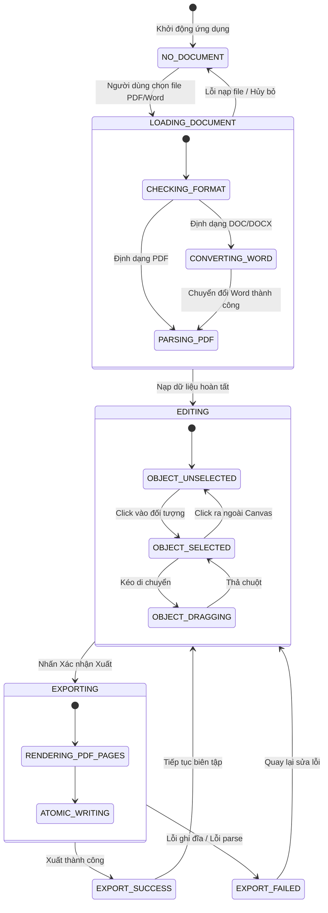

# Software Requirements Specification (SRS)
## CLUB SIGN TOOL (Công cụ Ký & Đóng dấu Kế hoạch CLB)

---

## 1. Document Information

- **Tên tài liệu:** Software Requirements Specification (SRS) - Club Sign Tool
- **Mã tài liệu:** SRS-CST-2026-V1.0
- **Phiên bản:** 1.0.0
- **Ngày ban hành:** 29/09/2026
- **Tác giả:** Senior Business Analyst + Desktop Software Architect + UX Engineer
- **Đối tượng áp dụng:** Core Development Team, UI/UX Designer, QA/Tester, Ban Chủ nhiệm Câu lạc bộ
- **Nền tảng mục tiêu:** Desktop Application (Windows 10 / Windows 11 x64, hỗ trợ offline 100%)
- **Phân loại phần mềm:** Standalone Local Desktop Utility (Không Server, Không Database, Không Cloud)

---

## 2. Revision History

| Phiên bản | Ngày | Tác giả | Tóm tắt thay đổi |
|---|---|---|---|
| `0.1.0` | 25/09/2026 | BA Team | Khảo sát nhu cầu ký duyệt văn bản nội bộ CLB sinh viên |
| `0.5.0` | 27/09/2026 | Architect | Xác lập kiến trúc Local Offline, loại bỏ hoàn toàn Database/Backend Server |
| `1.0.0` | 29/09/2026 | BA + Architect + UX | Hoàn thiện toàn bộ SRS 48 mục: Use Cases, UI Inventory, Edge Cases, Tech Stack, Traceability Matrix |

---

## 3. Introduction

### 3.1 Bối cảnh
Trong hoạt động thường niên của các Câu lạc bộ - Đội - Nhóm sinh viên tại các trường đại học, quy trình chuẩn bị hồ sơ tổ chức sự kiện, kế hoạch hoạt động, đơn xin tài trợ và tờ trình phê duyệt luôn yêu cầu chữ ký của Ban Chủ nhiệm (Chủ nhiệm, Phó Chủ nhiệm) và con dấu của Đơn vị/CLB trước khi trình nộp lên Đoàn trường, Hội Sinh viên hoặc Khoa/Viện. 

Thực trạng hiện nay:
1. Sinh viên thường in ra giấy, ký tay, đóng dấu đỏ thủ công rồi dùng điện thoại scan lại thành PDF $\rightarrow$ Gây tốn kém chi phí in ấn, giảm chất lượng bản scan, lệch góc, méo mó văn bản.
2. Sinh viên chèn ảnh chữ ký/con dấu bằng Microsoft Word $\rightarrow$ Định dạng văn bản bị vỡ layout, nhảy trang; con dấu chèn vào che mất chữ hoặc có nền trắng đục đè lên chữ ký và văn bản; khó căn chỉnh chính xác vị trí chuẩn theo quy chuẩn thể thức văn bản hành chính (Nghị định 30/2020/NĐ-CP).
3. Các công cụ online (Smallpdf, iLovePDF, Adobe Acrobat Pro Online) $\rightarrow$ Đòi hỏi trả phí đắt đỏ, giới hạn số lần sử dụng trong ngày, yêu cầu mạng Internet và tiềm ẩn rủi ro lộ lọt kế hoạch/thông tin nội bộ lên máy chủ bên thứ ba.

### 3.2 Mục tiêu dự án
Xây dựng một phần mềm máy tính (Desktop App) gọn nhẹ, chạy cục bộ (local/offline) 100% trên máy tính cá nhân, giải quyết dứt điểm nhu cầu:
- Mở nhanh tài liệu kế hoạch định dạng PDF hoặc Word (`.doc`, `.docx`).
- Tự động chuyển đổi file Word sang PDF chuẩn xác giữ nguyên định dạng thông qua LibreOffice Headless.
- Cung cấp giao diện trực quan cho phép kéo - thả chữ ký và con dấu vào vị trí chỉ định.
- Cho phép xử lý ảnh con dấu/chữ ký: xóa nền trắng (Remove White Background), tăng giảm độ trong suốt (opacity), xoay, chỉnh tỷ lệ.
- Hỗ trợ chèn chức danh, họ tên và ngày tháng văn bản chuẩn quy thức.
- Xuất ra file PDF hoàn chỉnh chất lượng in ấn cao để gửi cấp trên xét duyệt.

---

## 4. Product Purpose

Club Sign Tool được định vị là **"Local Desktop Productivity Utility"** phục vụ công tác văn phòng nội bộ của sinh viên. 

**Tôn chỉ cốt lõi (Core Principles):**
- **Offline First & Offline Always:** Không yêu cầu kết nối mạng; toàn bộ dữ liệu, tài liệu, chữ ký lưu trữ hoàn toàn trên ổ cứng người dùng.
- **Zero Infrastructure:** Không xây dựng backend server, không cơ sở dữ liệu quan hệ (PostgreSQL/MySQL) hay NoSQL/Redis, không tài khoản người dùng, không quyền truy cập mạng.
- **Speed & Simplicity:** Thời gian từ lúc mở file Word/PDF đến khi xuất file PDF đã ký hoàn tất không quá 30 giây đối với tài liệu thông thường.
- **Document Integrity:** Tuyệt đối không can thiệp, không làm thay đổi hoặc ghi đè lên file Word/PDF gốc của người dùng.

---

## 5. Product Scope

### 5.1 In-Scope (Thuộc phạm vi sản phẩm)
- Mở file tài liệu cục bộ: `.pdf`, `.docx`, `.doc`.
- Chuyển đổi ngầm Word sang PDF bằng LibreOffice Headless khi người dùng nạp file Word.
- Bộ xem và duyệt trang PDF (PDF Viewer) với thumbnails, zoom, pan, chuyển trang.
- Quản lý tài nguyên chữ ký và con dấu cá nhân (Asset Manager: lưu file ảnh cục bộ trong thư mục AppData).
- Công cụ xử lý ảnh nhanh: Cắt (Crop), đổi kích thước, xoay, lật, điều chỉnh độ sáng/tương phản và thuật toán tách nền trắng (White Background Removal) thành PNG trong suốt (Transparent).
- Trích xuất chữ ký/con dấu từ file PDF nguồn (PDF Asset Extraction).
- Trình chỉnh sửa đối tượng trên trang PDF (Interactive Canvas Overlay):
  - Kéo thả, thay đổi kích thước giữ nguyên tỷ lệ, xoay góc tự do.
  - Điều chỉnh Opacity (đặc biệt hữu ích cho con dấu đè lên chữ ký theo chuẩn thực tế).
  - Chèn Text Box (Chức vụ, Họ tên) và Date Box (Ngày tháng năm theo các định dạng văn bản Việt Nam).
  - Nhân bản đối tượng sang nhiều trang (Apply to current / selected / all pages).
  - Hoàn tác / Làm lại (Undo / Redo đa cấp).
- Xuất file PDF đã ký (Export Signed PDF) với chất lượng giữ nguyên vector/ảnh gốc, cơ chế ghi file an toàn (Atomic Write).
- Lưu trữ và mở lại phiên làm việc dưới dạng Project File (`.clbsign`).
- Tùy chỉnh cài đặt cục bộ (Cấu hình thư mục xuất, opacity mặc định, đường dẫn LibreOffice).

### 5.2 Out-of-Scope (Tuyệt đối không thực hiện)
- Hệ thống quản lý tài liệu doanh nghiệp (EDMS), tính năng cây thư mục lưu trữ đám mây.
- Đăng ký, đăng nhập, xác thực danh tính, phân quyền người dùng (RBAC), Admin Dashboard.
- Cơ sở dữ liệu tập trung (PostgreSQL, MongoDB, SQLite server, Redis).
- Dịch vụ đám mây (AWS S3, MinIO, Google Drive API, Firebase).
- Quy trình luân chuyển xét duyệt (Approval Workflow / Document Routing) qua mạng LAN hay Internet.
- Ký số mã hóa mật mã học (Cryptographic Digital Signature - X.509, PKI, PAdES, USB Token, SmartCard) trong giai đoạn MVP.
- Nhận dạng ký tự quang học toàn diện (Full-document OCR).
- Trình chỉnh sửa trực tiếp nội dung văn bản gốc của file Word hoặc PDF (Text editor / Document reflow).

---

## 6. Definitions & Terminology

| Thuật ngữ | Định nghĩa |
|---|---|
| **Visual Signature** | Chữ ký hình ảnh (ảnh scan/chụp chữ ký viết tay) được chèn như một layer đồ họa đè lên văn bản PDF tại vị trí mong muốn. |
| **Visual Stamp** | Con dấu hình ảnh (dấu tròn đỏ của tổ chức, dấu chức danh chữ nhật) chèn đè lên văn bản hoặc đè 1/3 lên chữ ký. |
| **Cryptographic Signature** | Chữ ký số điện tử sử dụng cặp khóa công khai/bí mật theo chuẩn PKI (X.509, PAdES) có giá trị pháp lý mã hóa, khác hoàn toàn với Visual Signature. |
| **Normalized Coordinates** | Hệ tọa độ chuẩn hóa tỷ lệ từ `0.0` đến `1.0` dựa trên chiều rộng và chiều cao thực tế của từng trang PDF. |
| **PDF User Space Points** | Đơn vị đo lường chuẩn của PDF (1 point = 1/72 inch). A4 = 595.28 x 841.89 points. |
| **LibreOffice Headless** | Chế độ thực thi dòng lệnh không giao diện người dùng của bộ phần mềm văn phòng LibreOffice, dùng để chuyển đổi định dạng tài liệu. |
| **White Thresholding** | Thuật toán quét điểm ảnh trong không gian màu RGB để xác định các pixel tiệm cận màu trắng và chuyển đổi kênh Alpha của chúng về 0 (trong suốt). |
| **Atomic Write** | Cơ chế ghi file thông qua việc xuất ra một file tạm (`.tmp`), sau khi hoàn tất mới đổi tên (rename) đè lên đích, đảm bảo file không bao giờ bị hỏng dở dang nếu xảy ra lỗi. |
| **Asset Manager** | Mô-đun quản lý danh sách file ảnh chữ ký và con dấu được lưu trong thư mục cục bộ của ứng dụng. |
| **Project File (.clbsign)** | Tệp tin định dạng JSON đóng gói trạng thái phiên làm việc gồm thông tin file gốc, danh sách đối tượng, tọa độ và tham chiếu tài nguyên. |

---

## 7. Assumptions & Constraints

### 7.1 Assumptions (Giả định)
1. Người dùng sử dụng máy tính chạy hệ điều hành Windows 10 (bản 1809 trở lên) hoặc Windows 11 x64, có sẵn Microsoft Edge WebView2 Evergreen Runtime.
2. Để chuyển đổi file `.doc` / `.docx`, máy tính người dùng cần được cài đặt sẵn LibreOffice (khuyến nghị phiên bản 7.x hoặc 24.x trở lên). Nếu chưa có, phần mềm vẫn hoạt động bình thường với các file `.pdf`.
3. Người dùng có quyền đọc/ghi trên thư mục chứa tài liệu gốc và thư mục lưu trữ cấu hình người dùng (`%APPDATA%`).
4. Các văn bản kế hoạch câu lạc bộ có kích thước trang phổ biến là A4 tiêu chuẩn (Portrait hoặc Landscape), một số trường hợp đặc thù có thể là Letter hoặc A3.

### 7.2 Constraints (Ràng buộc hệ thống)
1. **Ràng buộc công nghệ:** Ứng dụng phải đóng gói thành 1 file cài đặt (Setup `.exe` hoặc Portable `.exe`) có dung lượng bộ cài tối ưu (< 30 MB nếu dùng Tauri; không chấp nhận ứng dụng nặng hàng trăm MB như Electron cồng kềnh nếu không cần thiết).
2. **Ràng buộc bảo mật & riêng tư:** Không mở bất kỳ cổng lắng nghe mạng (listening port) ra ngoài; không chứa bất kỳ mã theo dõi (telemetry) hoặc thư viện phân tích hành vi người dùng (Google Analytics, Sentry).
3. **Ràng buộc tính toàn vẹn:** File Word gốc (`.docx`, `.doc`) và file PDF gốc khi mở vào ứng dụng phải được mở ở chế độ Read-Only, không bao giờ được phép sửa đổi trực tiếp nội dung gốc.

---

## 8. User Profile

| Đặc tính | Mô tả chi tiết |
|---|---|
| **Đối tượng sử dụng** | Sinh viên thuộc Ban Chủ nhiệm (Chủ nhiệm, Phó Chủ nhiệm), Trưởng/Phó Ban chuyên môn (Truyền thông, Sự kiện, Hậu cần), Thư ký CLB. |
| **Trình độ tin học** | Cơ bản đến trung bình (thành thạo tin học văn phòng Word/Excel, sử dụng máy tính hàng ngày, không có kiến thức kỹ thuật chuyên sâu về đồ họa hoặc công nghệ thông tin). |
| **Mục đích chính** | Ký duyệt các bản kế hoạch sự kiện, dự trù kinh phí, quyết định phân công, giấy triệu tập để gửi Đoàn trường, Hội Sinh viên hoặc các đối tác tài trợ một cách chuyên nghiệp, nhanh gọn. |
| **Môi trường sử dụng** | Laptop cá nhân của sinh viên, thường xuyên làm việc tại văn phòng Đoàn - Hội, quán cà phê hoặc ở nhà; đôi khi không có kết nối Wi-Fi ổn định. |

---

## 9. System Overview & Workflow

### 9.1 Kiến trúc tổng quan hệ thống cục bộ
```
┌────────────────────────────────────────────────────────────────────────┐
│                        CLUB SIGN TOOL (DESKTOP)                        │
├────────────────────────────────────────────────────────────────────────┤
│  [FRONTEND LAYER - React 19 + TypeScript + Custom Canvas Engine]       │
│  - Screens: Home | Document Editor | Asset Manager | Image Editor      │
│  - Viewport: PDF.js Viewer (Rendering Pages to Canvas)                 │
│  - Interaction Overlay: Object Placement (Drag, Resize, Rotate, Snap)  │
│  - State Machine: Editor State, History Stack (Undo/Redo)              │
├────────────────────────────────────────────────────────────────────────┤
│  [TAURI INTERPROCESS COMMUNICATION (IPC) BRIDGE]                       │
├────────────────────────────────────────────────────────────────────────┤
│  [NATIVE BACKEND LAYER - Rust Core]                                    │
│  - File System Access (Native Dialog, Safe Atomic I/O)                 │
│  - Word Conversion Engine (LibreOffice Headless Process Invoker)       │
│  - Native Image Processor (Image Thresholding, Crop, Alpha Channel)    │
│  - PDF Export Engine (pdf-lib / lopdf: Object Embedding, Byte Stitch)  │
│  - Local Config & Asset Storage Manager (%APPDATA%/ClubSignTool/)      │
└────────────────────────────────────────────────────────────────────────┘
                                    │
          ┌─────────────────────────┴─────────────────────────┐
          ▼                                                   ▼
┌───────────────────────┐                           ┌────────────────────┐
│ Local File System     │                           │ External Tool      │
│ - Source Documents    │                           │ - LibreOffice      │
│ - Assets (PNG/SVG)    │                           │   (soffice.exe)    │
│ - config.json         │                           └────────────────────┘
│ - Output Signed PDFs  │
└───────────────────────┘
```

### 9.2 Luồng trải nghiệm người dùng chuẩn (User Journey)
```text
[Mở file DOCX / PDF]
        │
        ├── (Nếu DOCX) ──> [LibreOffice tự chuyển đổi sang PDF tạm thời] ──┐
        └── (Nếu PDF)  ────────────────────────────────────────────────────┤
                                                                           ▼
                                                             [Hiển thị văn bản trong PDF Editor]
                                                                           │
               ┌───────────────────────────────────────────────────────────┴─────────────────────────┐
               ▼                                                           ▼                         ▼
   [Chọn Chữ ký từ Asset Manager]                             [Chọn Con dấu từ Asset Manager]  [Chèn Ngày/Text]
               │                                                           │                         │
               └───────────────────────────┬───────────────────────────────┘                         │
                                           ▼                                                         │
                        [Kéo - Thả vào vị trí ký duyệt văn bản]                                      │
                                           │                                                         │
                        [Căn chỉnh: Scale, Xoay, Tinh chỉnh Opacity] <───────────────────────────────┘
                                           │
                        [Xem trước bản xuất (Export Preview)]
                                           │
                        [Nhấn "Xuất PDF hoàn tất"]
                                           │
                        [File PDF_SIGNED.pdf được lưu an toàn]
```

---

## 10. Functional Requirements

### 10.1 Quản lý Tập tin & Nạp Tài liệu (`FR-FILE`, `FR-WORD`)
- **`FR-FILE-001`**: Cho phép người dùng mở file tài liệu qua hộp thoại chọn file hệ thống (System File Dialog) hoặc bằng thao tác Kéo - Thả (Drag & Drop) trực tiếp vào cửa sổ ứng dụng.
- **`FR-FILE-002`**: Hỗ trợ các định dạng file đầu vào: `.pdf`, `.docx`, `.doc`.
- **`FR-FILE-003`**: Hiển thị danh sách tài liệu mở gần đây (Recent Documents) tối đa 10 file gần nhất tại màn hình Home, hiển thị tên file, đường dẫn và thời gian mở.
- **`FR-FILE-004`**: Khi người dùng chọn một file từ danh sách Recent Documents mà file đó không còn tồn tại trên ổ đĩa, ứng dụng phải hiển thị cảnh báo thân thiện và tự động xóa mục đó khỏi danh sách.
- **`FR-WORD-001`**: Khi người dùng nạp file `.docx` hoặc `.doc`, hệ thống phải kích hoạt tiến trình chạy ngầm gọi LibreOffice Headless để chuyển đổi sang file PDF tạm thời lưu tại thư mục `%APPDATA%/ClubSignTool/temp/`.
- **`FR-WORD-002`**: Hệ thống phải tự động quét các đường dẫn cài đặt mặc định của LibreOffice trên Windows (`C:\Program Files\LibreOffice\program\soffice.exe` và `C:\Program Files (x86)\...`).
- **`FR-WORD-003`**: Nếu không tìm thấy LibreOffice trên máy tính, hệ thống phải hiển thị thông báo hướng dẫn chi tiết kèm đường dẫn tải chính thức, tuyệt đối không gây treo hoặc crash ứng dụng.
- **`FR-WORD-004`**: Quá trình chuyển đổi Word sang PDF phải chạy bất đồng bộ (asynchronous), có thanh tiến trình (progress indicator) và không gây đóng băng (freeze) giao diện người dùng.
- **`FR-WORD-005`**: Tuyệt đối bảo tồn nguyên trạng file Word gốc, không chỉnh sửa thuộc tính hay nội dung của file gốc.

### 10.2 Trình xem & Duyệt PDF (`FR-PDF`)
- **`FR-PDF-001`**: Hiển thị chính xác các trang của tài liệu PDF với độ sắc nét cao (tối thiểu 150 DPI đối với chế độ xem thông thường).
- **`FR-PDF-002`**: Cung cấp thanh thu nhỏ các trang (Page Thumbnails Sidebar) hiển thị danh sách trang theo chiều dọc, kèm số thứ tự trang.
- **`FR-PDF-003`**: Cho phép chuyển nhanh đến một trang bằng cách nhấp chuột vào Thumbnail tương ứng hoặc nhập số trang vào ô điều hướng.
- **`FR-PDF-004`**: Hỗ trợ các chế độ thu phóng (Zoom): Thu phóng tùy ý bằng thanh trượt (từ 25% đến 400%), phóng to/thu nhỏ bằng phím tắt `Ctrl + Cuộn chuột`, nút "Fit Page" (vừa toàn bộ trang) và nút "Fit Width" (vừa chiều rộng khung nhìn).
- **`FR-PDF-005`**: Hỗ trợ cuộn chuột mượt mà (smooth scrolling) giữa các trang liên tiếp hoặc chuyển trang theo từng bước (Page-by-Page mode).
- **`FR-PDF-006`**: Tự động nhận diện và hiển thị đúng hướng xoay (Rotation 0°, 90°, 180°, 270°) và kích thước riêng biệt của từng trang trong các tài liệu có kích thước trang hỗn hợp (Mixed Page Sizes: vừa có trang dọc Portrait, vừa có trang ngang Landscape).

### 10.3 Quản lý & Thao tác Chữ ký (`FR-SIG`)
- **`FR-SIG-001`**: Cho phép import chữ ký từ các định dạng file: `.png`, `.jpg`, `.jpeg`, `.svg`, `.pdf`.
- **`FR-SIG-002`**: Hỗ trợ thao tác kéo trực tiếp chữ ký từ Asset Manager thả vào bất kỳ tọa độ nào trên trang PDF hiện hành.
- **`FR-SIG-003`**: Cung cấp khung điều khiển (Bounding Box Transform Controls) bao quanh chữ ký được chọn gồm: 4 điểm kéo góc (Corner Handles) để thay đổi kích thước, điểm xoay (Rotation Handle) ở đỉnh, và điểm dịch chuyển.
- **`FR-SIG-004`**: Mặc định khóa tỷ lệ khung hình (Lock Aspect Ratio) khi co giãn chữ ký để tránh làm biến dạng nét ký; cho phép mở khóa tự do nếu người dùng giữ phím `Shift` hoặc bấm nút toggle trên thanh thuộc tính.
- **`FR-SIG-005`**: Cho phép điều chỉnh độ trong suốt (Opacity) của chữ ký từ 10% đến 100% (mặc định 100%).
- **`FR-SIG-006`**: Hỗ trợ các thao tác chỉnh sửa chuẩn: Sao chép (`Ctrl+C`), Dán (`Ctrl+V`), Nhân bản (`Ctrl+D`), Xóa (`Delete` / `Backspace`).
- **`FR-SIG-007`**: Cho phép đặt một chữ ký làm "Chữ ký mặc định" (Default Signature) để tự động chọn sẵn khi mở tài liệu mới.

### 10.4 Quản lý & Thao tác Con dấu (`FR-STAMP`)
- **`FR-STAMP-001`**: Cho phép import con dấu từ các định dạng: `.png`, `.jpg`, `.jpeg`, `.svg`, `.pdf`.
- **`FR-STAMP-002`**: Hỗ trợ đầy đủ hai loại hình dáng con dấu phổ biến: Con dấu tròn (Dấu đỏ cơ quan, tổ chức, CLB) và Con dấu vuông/chữ nhật (Dấu chức danh, dấu "ĐÃ PHÊ DUYỆT").
- **`FR-STAMP-003`**: Cho phép đặt con dấu đè lên trên một phần của chữ ký (khoảng 1/3 diện tích chữ ký) theo đúng chuẩn văn thức quản lý nhà nước; cung cấp nút điều khiển thứ tự hiển thị (Z-Index: Bring Forward, Send Backward).
- **`FR-STAMP-004`**: Cho phép thiết lập độ trong suốt mặc định của con dấu (khuyến nghị 85% - 90%) để khi đóng dấu đè lên văn bản hoặc chữ ký thì chữ bên dưới vẫn đọc được rõ ràng.
- **`FR-STAMP-005`**: Khóa cố định tỷ lệ 1:1 đối với dấu tròn để đảm bảo con dấu không bao giờ bị méo thành hình elip.

### 10.5 Quản lý Thư viện Tài nguyên (`FR-LOCAL-ASSET`)
- **`FR-LOCAL-001`**: Cung cấp giao diện Quản lý tài nguyên (Asset Manager) gồm 2 Tab chuyên biệt: "Chữ ký" (Signatures) và "Con dấu" (Stamps).
- **`FR-LOCAL-002`**: Cho phép xem trước (Thumbnail Preview), đổi tên hiển thị, xóa, nhân bản và mở chỉnh sửa lại các asset đã lưu.
- **`FR-LOCAL-003`**: Toàn bộ file ảnh asset được sao chép và lưu trữ an toàn trong thư mục cục bộ của ứng dụng tại `%APPDATA%/ClubSignTool/assets/signatures/` và `%APPDATA%/ClubSignTool/assets/stamps/`.
- **`FR-LOCAL-004`**: Quản lý danh mục asset bằng một file chỉ mục `assets.json` lưu trữ thông tin meta: `id`, `name`, `type`, `filePath`, `createdAt`, `isDefault`, `defaultWidth`, `defaultHeight`, `defaultOpacity`.
- **`FR-LOCAL-005`**: Khi xóa một asset trong danh sách, hệ thống phải hỏi xác nhận và thực hiện xóa an toàn file ảnh trong thư mục cục bộ.

### 10.6 Xử lý & Tinh chỉnh Ảnh (`FR-IMG`)
- **`FR-IMG-001`**: Cung cấp màn hình Image Editor mở ra khi người dùng import ảnh mới hoặc bấm "Chỉnh sửa" một asset hiện có.
- **`FR-IMG-002`**: Chức năng Cắt ảnh (Crop): Cho phép kéo khung cắt chữ nhật tùy ý để loại bỏ các viền thừa xung quanh chữ ký hoặc con dấu.
- **`FR-IMG-003`**: Chức năng Xoay ảnh: Xoay nhanh 90° cùng/ngược chiều kim đồng hồ, xoay tự do theo thanh trượt góc từ -180° đến +180°.
- **`FR-IMG-004`**: Chức năng Lật ảnh: Lật ngang (Flip Horizontal) và Lật dọc (Flip Vertical).
- **`FR-IMG-005`**: Chức năng Điều chỉnh màu: Thanh trượt Tăng/Giảm độ sáng (Brightness) và Độ tương phản (Contrast) để làm nổi bật nét mực trước khi tách nền.
- **`FR-IMG-006`**: **Chức năng Tách nền trắng (Remove White Background):**
  - Cung cấp nút bấm "Tự động tách nền" (Auto Remove Background).
  - Cung cấp thanh trượt "Ngưỡng tách nền" (Tolerance / Threshold) với thang đo từ 0 đến 100 (tương ứng phạm vi phân biệt màu trắng giấy).
  - Thuật toán chuyển đổi các pixel có độ sáng cao hơn ngưỡng thành điểm trong suốt (Alpha = 0) và làm mượt biên viền nét chữ (Anti-aliasing feathering).
  - Hiển thị khung xem trước thời gian thực (Real-time Preview) trên nền ô bàn cờ (Checkerboard background) biểu thị vùng trong suốt.
- **`FR-IMG-007`**: Nút "Khôi phục gốc" (Reset) để hoàn tác toàn bộ thao tác chỉnh sửa ảnh về trạng thái ban đầu khi vừa import.
- **`FR-IMG-008`**: **Nhập asset từ file PDF (PDF Asset Import):**
  - Nếu người dùng chọn file nguồn là PDF (chứa chữ ký scan trong văn bản cũ), hệ thống hiển thị danh sách các trang PDF để người dùng chọn trang.
  - Render trang được chọn ở độ phân giải cao (300 DPI) đưa vào Image Editor để người dùng kéo khung crop lấy riêng phần chữ ký hoặc con dấu, sau đó chuyển sang xử lý tách nền.

### 10.7 Công cụ Văn bản & Ngày tháng (`FR-TEXT`, `FR-DATE`)
- **`FR-TEXT-001`**: Cho phép người dùng nhấp chọn công cụ Text và nhấp lên trang PDF để tạo hộp văn bản nhập chức danh, họ tên (ví dụ: *"TM. BAN CHỦ NHIỆM / CHỦ NHIỆM / Nguyễn Văn A"*).
- **`FR-TEXT-002`**: Hỗ trợ định dạng văn bản: Chọn Font chữ (các font chuẩn hỗ trợ Tiếng Việt như Times New Roman, Arial, Roboto), Cỡ chữ (Font size từ 8pt đến 72pt), Đậm (Bold), Nghiêng (Italic), Căn lề (Trái, Giữa, Phải), Màu chữ (Mặc định Đen `#000000`, Xanh dương đậm `#000080`, Đỏ `#C00000`).
- **`FR-DATE-001`**: Cho phép chèn nhanh ngày tháng văn bản hiện tại hoặc tùy chọn qua lịch chọn ngày (Date Picker).
- **`FR-DATE-002`**: Cung cấp sẵn các mẫu định dạng ngày chuẩn văn thức hành chính Việt Nam:
  - *Mẫu 1:* `Đà Nẵng, ngày 29 tháng 09 năm 2026`
  - *Mẫu 2:* `Ngày 29 tháng 09 năm 2026`
  - *Mẫu 3:* `29/09/2026`
  - *Mẫu 4:* `29-09-2026`
- **`FR-DATE-003`**: Cho phép tùy chỉnh tên địa danh (mặc định lấy theo cấu hình người dùng, ví dụ: "Hà Nội", "TP. Hồ Chí Minh", "Đà Nẵng").

### 10.8 Thao tác Đa trang & Tương tác Canvas (`FR-EDITOR`)
- **`FR-EDITOR-001`**: Hỗ trợ phím tắt và nút bấm Hoàn tác (`Ctrl + Z`) và Làm lại (`Ctrl + Y` hoặc `Ctrl + Shift + Z`) với độ sâu lịch sử tối thiểu 30 bước cho tất cả thao tác thêm, sửa, xóa, di chuyển, phóng to, thu nhỏ đối tượng.
- **`FR-EDITOR-002`**: Hỗ trợ căn dóng tự động (Snapping & Smart Alignment Guides): Hiển thị đường dóng màu đỏ khi đối tượng di chuyển đến vị trí giữa trang (Center X, Center Y) hoặc thẳng hàng với các đối tượng khác.
- **`FR-EDITOR-003`**: **Thao tác áp dụng đa trang (Multi-Page Operations):**
  - Cho phép người dùng chuột phải vào một đối tượng (hoặc chọn trên thanh công cụ) và chọn:
    - *Áp dụng cho trang hiện tại (Current page only)*.
    - *Áp dụng cho tất cả các trang (All pages)* - ví dụ: dấu giáp lai góc phải.
    - *Áp dụng cho các trang tùy chọn (Custom range)* - ví dụ: `1,3,5-7`.
  - Hiển thị hộp thoại cảnh báo xác nhận trước khi sao chép hàng loạt đối tượng lên nhiều trang.
- **`FR-EDITOR-004`**: Cho phép khóa đối tượng (Lock Object) để tránh vô tình nhấp chuột làm lệch vị trí khi đang thao tác đối tượng khác.

### 10.9 Lưu & Mở Dự án Tạm (`FR-PROJECT`)
- **`FR-PROJECT-001`**: Cho phép lưu toàn bộ trạng thái phiên làm việc hiện tại thành tệp dự án định dạng `.clbsign` (`Ctrl + S`).
- **`FR-PROJECT-002`**: File `.clbsign` chứa cấu trúc JSON lưu đường dẫn file gốc, cấu hình trang, danh sách tất cả các đối tượng (chữ ký, con dấu, text, date) kèm thuộc tính tọa độ, kích thước, độ xoay, opacity và tham chiếu asset.
- **`FR-PROJECT-003`**: Khi mở lại file `.clbsign` (`Ctrl + O`), ứng dụng khôi phục chính xác trạng thái làm việc trước đó. Nếu file gốc hoặc asset bị di chuyển/xóa, ứng dụng hiển thị hộp thoại cảnh báo và cho phép người dùng chọn đường dẫn thay thế (Relink Missing Files).

### 10.10 Xuất File PDF Ký Hoàn Tất (`FR-EXPORT`)
- **`FR-EXPORT-001`**: Cung cấp cửa sổ Xem trước trước khi xuất (Export Preview Modal) cho phép người dùng lật xem toàn bộ các trang tài liệu hoàn thiện sau khi đã gắn đối tượng.
- **`FR-EXPORT-002`**: Khi người dùng nhấn "Xác nhận Xuất PDF", hệ thống thực hiện nạp file PDF gốc, vẽ chèn các đối tượng chữ ký, con dấu, text theo đúng tọa độ thực tế lên từng trang bằng thư viện xử lý PDF vector.
- **`FR-EXPORT-003`**: Đảm bảo chất lượng xuất tối đa: Giữ nguyên văn bản gốc dạng vector có thể bôi đen/tìm kiếm (searchable text), giữ nguyên kích thước và tỷ lệ trang gốc, nhúng ảnh chữ ký/con dấu ở độ phân giải nguyên bản.
- **`FR-EXPORT-004`**: Tự động gợi ý tên file xuất theo quy tắc: `[Tên_File_Gốc]_SIGNED.pdf` và lưu vào thư mục xuất mặc định hoặc mở hộp thoại "Save As" cho người dùng chỉ định.
- **`FR-EXPORT-005`**: Cơ chế ghi an toàn (Atomic File Output): Xuất file ra đường dẫn tạm `[Tên_File_Gốc]_SIGNED.pdf.tmp`, sau khi ghi hoàn tất và xác thực tính toàn vẹn mới đổi tên thành `.pdf`. Nếu có lỗi trong quá trình xuất, file tạm bị xóa ngay lập tức và giữ nguyên trạng ổ đĩa.
- **`FR-EXPORT-006`**: Khi xuất thành công, hiển thị thông báo với 2 nút hành động nhanh: "Mở file PDF vừa xuất" (mở bằng trình đọc PDF mặc định của Windows) và "Mở thư mục chứa file" (Open containing folder trong File Explorer).

### 10.11 Cài đặt Ứng dụng (`FR-SETTINGS`)
- **`FR-SETTINGS-001`**: Cung cấp màn hình Cài đặt (Settings) cho phép cấu hình:
  - Thư mục xuất mặc định (Default Output Directory).
  - Tùy chọn nhớ thư mục mở gần nhất (Remember Last Opened Folder).
  - Độ trong suốt mặc định cho Con dấu (Slider 50% - 100%, mặc định 85%).
  - Độ trong suốt mặc định cho Chữ ký (Slider 50% - 100%, mặc định 100%).
  - Tự động chọn chữ ký mặc định khi mở tài liệu mới (Bật/Tắt).
  - Đường dẫn tùy biến tới file thực thi của LibreOffice (`soffice.exe`).
  - Đường dẫn thư mục lưu file tạm (Temp Directory).
  - Tự động xóa file cache/temp khi đóng ứng dụng (Bật/Tắt).
  - Giao diện (Theme): Sáng (Light), Tối (Dark), Theo hệ thống (System).
- **`FR-SETTINGS-002`**: Toàn bộ cài đặt được lưu trữ cục bộ trong file `config.json` tại `%APPDATA%/ClubSignTool/config.json`.

---

## 11. Detailed Use Cases

### UC-001: Mở Tài liệu PDF
- **Actor:** Người dùng (Ban Chủ nhiệm CLB).
- **Preconditions:** Ứng dụng đã khởi chạy và đang ở màn hình Home hoặc Document Editor.
- **Trigger:** Người dùng nhấn nút "Mở tài liệu", kéo thả file PDF vào ứng dụng, hoặc nhấn `Ctrl + O`.
- **Main Flow:**
  1. Ứng dụng hiển thị hộp thoại chọn file của hệ điều hành, lọc các đuôi file hỗ trợ (`.pdf`, `.docx`, `.doc`).
  2. Người dùng chọn một file `.pdf` hợp lệ và nhấn "Open".
  3. Hệ thống nạp file PDF vào bộ nhớ, đọc thông tin metadata (số trang, kích thước từng trang, hướng xoay).
  4. Hệ thống chuyển sang màn hình **Document Editor**:
     - Render danh sách thumbnail các trang ở thanh bên trái.
     - Render trang đầu tiên (Page 1) lên khung xem chính giữa (Viewer Canvas).
     - Đặt thanh công cụ ở trạng thái sẵn sàng thao tác.
  5. Hệ thống lưu đường dẫn file vào danh sách "Recent Documents" trong `config.json`.
- **Alternative Flow (Drag & Drop):**
  - Tại bước 1, người dùng kéo trực tiếp file `.pdf` từ Windows File Explorer thả vào vùng "Drop Area" của ứng dụng $\rightarrow$ Hệ thống lập tức thực hiện tiếp bước 3.
- **Exception Flow:**
  - *File bị hỏng (Corrupted):* Hệ thống bắt lỗi, hiển thị dialog: *"Không thể mở tài liệu. Tệp tin bị lỗi hoặc không đúng định dạng PDF chuẩn."* $\rightarrow$ Giữ nguyên màn hình hiện tại.
  - *File có mật khẩu (Password Protected):* Hệ thống hiển thị hộp thoại yêu cầu nhập mật khẩu mở file $\rightarrow$ Nếu người dùng nhập đúng thì mở tiếp; nếu người dùng bấm Hủy thì hủy quy trình.
- **Postconditions:** Tài liệu PDF được hiển thị đầy đủ trên giao diện Editor; sẵn sàng cho các thao tác chèn đối tượng.
- **Related Requirements:** `FR-FILE-001`, `FR-FILE-002`, `FR-PDF-001`, `FR-PDF-002`.

---

### UC-002: Mở Tài liệu Word (.docx / .doc) & Tự động Chuyển đổi
- **Actor:** Người dùng.
- **Preconditions:** Ứng dụng đang hoạt động; máy tính đã cài đặt LibreOffice.
- **Trigger:** Người dùng chọn hoặc kéo thả file `.docx` / `.doc` vào ứng dụng.
- **Main Flow:**
  1. Người dùng chọn file `KeHoachSuKien.docx`.
  2. Hệ thống phát hiện định dạng Word, hiển thị màn hình mờ (Overlay Modal) kèm thanh tiến trình: *"Đang chuyển đổi tài liệu Word sang PDF bằng LibreOffice... Vui lòng đợi trong giây lát."*
  3. Hệ thống gọi tiến trình dòng lệnh ngầm (LibreOffice CLI):
     `soffice.exe --headless --convert-to pdf --outdir "%APPDATA%/ClubSignTool/temp/" "D:/KeHoachSuKien.docx"`
  4. Tiến trình tạo ra file tạm thời `KeHoachSuKien.pdf` tại thư mục `temp`.
  5. Hệ thống đóng modal tiến trình, tự động nạp file PDF tạm này vào màn hình Document Editor.
  6. Gắn nhãn trên thanh tiêu đề: `KeHoachSuKien.docx [Đã chuyển đổi sang PDF]`.
- **Alternative Flow:** Không có.
- **Exception Flow:**
  - *Chưa cài đặt LibreOffice:* Hệ thống phát hiện không tìm thấy file thực thi `soffice.exe` $\rightarrow$ Dừng tiến trình, hiển thị modal hướng dẫn: *"Không thể chuyển đổi Word sang PDF do máy tính chưa có LibreOffice. Vui lòng cài đặt LibreOffice (miễn phí) hoặc tự lưu file Word dưới dạng PDF trước khi mở."* Kèm nút *"Mở trang tải LibreOffice"* và nút *"Chọn đường dẫn thủ công"*.
  - *Chuyển đổi thất bại (File Word lỗi/bị khóa):* Hiển thị thông báo: *"Chuyển đổi thất bại. File Word có thể đang được mở bởi ứng dụng khác hoặc bị khóa chỉnh sửa. Vui lòng đóng Word và thử lại."*
- **Postconditions:** Bản PDF sinh ra từ file Word được nạp vào Editor; file Word gốc được giữ nguyên 100%.
- **Related Requirements:** `FR-FILE-002`, `FR-WORD-001` đến `FR-WORD-005`.

---

### UC-003: Import & Tách Nền Trắng Chữ Ký / Con Dấu
- **Actor:** Người dùng.
- **Preconditions:** Đang ở màn hình Asset Manager hoặc bấm nút "Thêm chữ ký/con dấu mới".
- **Trigger:** Người dùng nhấn nút "Import Chữ ký" hoặc "Import Con dấu".
- **Main Flow:**
  1. Hộp thoại mở ra, người dùng chọn ảnh chụp chữ ký trên giấy trắng (`ChuKy_ChuNhiem.jpg`).
  2. Hệ thống mở cửa sổ **Image Editor** hiển thị ảnh gốc.
  3. Người dùng sử dụng công cụ Crop kéo vùng chữ nhật sát nét chữ ký để loại bỏ phần giấy thừa.
  4. Người dùng nhấn nút **"Auto Remove Background"** (Tự động tách nền trắng).
  5. Hệ thống áp dụng thuật toán quét ngưỡng sáng: toàn bộ nền giấy trắng được chuyển thành các pixel trong suốt (hiển thị caro checkerboard).
  6. Người dùng kéo thanh trượt "Background Threshold" để tinh chỉnh độ sạch của nét ký đến khi vừa ý.
  7. Người dùng đặt tên cho asset: *"Chữ ký Chủ nhiệm - Nguyễn Văn A"* và nhấn "Lưu vào Thư viện".
  8. Hệ thống xuất ảnh kết quả thành file PNG trong suốt, lưu vào `%APPDATA%/ClubSignTool/assets/signatures/[uuid].png`, cập nhật thông tin vào `assets.json`.
- **Alternative Flow (Import từ PDF):**
  - Tại bước 1, người dùng chọn file `QuyetDinhCu.pdf`.
  - Hệ thống hiển thị hộp thoại chọn trang $\rightarrow$ Người dùng chọn Trang 3 $\rightarrow$ Hệ thống render trang 3 thành ảnh độ phân giải cao $\rightarrow$ Chuyển tiếp sang bước 2.
- **Exception Flow:**
  - File ảnh không hợp lệ hoặc quá lớn (> 25 MB): Hệ thống cảnh báo dung lượng ảnh và đề nghị chọn ảnh khác hoặc tự động nén kích thước chiều dài nhất về 2048px.
- **Postconditions:** Asset mới được lưu thành công vào thư viện cục bộ và sẵn sàng sử dụng.
- **Related Requirements:** `FR-SIG-001`, `FR-IMG-001` đến `FR-IMG-008`, `FR-LOCAL-003`.

---

### UC-004: Chèn & Định Vị Chữ Ký, Con Dấu Trên Trang PDF
- **Actor:** Người dùng.
- **Preconditions:** Tài liệu đã được mở trong Document Editor; thư viện đã có sẵn ít nhất một chữ ký và một con dấu.
- **Trigger:** Người dùng kéo một asset từ thanh Sidebar thả vào trang PDF hoặc nhấp đúp vào asset.
- **Main Flow:**
  1. Người dùng bấm giữ chuột vào biểu tượng "Chữ ký Chủ nhiệm" trên bảng Asset bên cạnh, kéo vào khu vực cuối trang 2 (phần ký tên) rồi thả chuột.
  2. Đối tượng chữ ký xuất hiện tại vị trí thả chuột, tự động được chọn với khung viền bao quanh (Bounding Box).
  3. Người dùng nhấp vào góc khung viền kéo chuột để phóng to/thu nhỏ chữ ký cho cân đối với khoảng trống văn bản (tỷ lệ khung hình được khóa tự động).
  4. Người dùng tiếp tục kéo "Con dấu CLB" thả vào vị trí bên cạnh chữ ký.
  5. Người dùng di chuyển con dấu đè lên khoảng 1/3 góc trái của chữ ký.
  6. Trên bảng thuộc tính (Properties Panel), người dùng kiểm tra độ trong suốt của con dấu (mặc định 85%) $\rightarrow$ Nét chữ ký và dòng chữ bên dưới con dấu vẫn hiển thị rõ ràng.
- **Alternative Flow:**
  - Người dùng bấm nút "Set Default" cho chữ ký $\rightarrow$ Khi mở tài liệu mới, bấm nút "Chèn chữ ký mặc định" trên thanh công cụ $\rightarrow$ Chữ ký lập tức xuất hiện ở góc dưới trang hiện hành mà không cần kéo thả.
- **Exception Flow:**
  - Kéo thả trượt ra ngoài vùng hiển thị của trang PDF $\rightarrow$ Đối tượng tự động canh chỉnh nằm trọn vẹn bên trong lề của trang PDF gần nhất.
- **Postconditions:** Hai đối tượng (Chữ ký và Con dấu) nằm đúng vị trí chỉ định trên trang 2 với đầy đủ thuộc tính tọa độ, kích thước, độ xoay và opacity.
- **Related Requirements:** `FR-SIG-002` đến `FR-SIG-005`, `FR-STAMP-002` đến `FR-STAMP-005`.

---

### UC-005: Chèn Văn Bản Chức Danh & Ngày Tháng
- **Actor:** Người dùng.
- **Preconditions:** Tài liệu đang mở trong Editor.
- **Trigger:** Người dùng bấm vào nút "Chèn Ngày" (Date Tool) hoặc "Chèn Chữ" (Text Tool).
- **Main Flow:**
  1. Người dùng chọn công cụ **Date Tool** trên thanh công cụ dưới.
  2. Một hộp thoại popover mở ra cho phép chọn định dạng: Người dùng chọn preset *"Đà Nẵng, ngày DD tháng MM năm YYYY"*. Ngày được mặc định là ngày hôm nay.
  3. Người dùng nhấp chuột vào vị trí phía trên ô chữ ký $\rightarrow$ Dòng chữ *"Đà Nẵng, ngày 29 tháng 09 năm 2026"* xuất hiện.
  4. Người dùng bấm công cụ **Text Tool**, nhấp vào dưới ngày tháng, nhập: *"TM. BAN CHỦ NHIỆM\nCHỦ NHIỆM"*.
  5. Người dùng bôi đen, chọn kiểu font Times New Roman, cỡ chữ 13pt, in đậm, căn giữa.
- **Postconditions:** Các đối tượng Text và Date được gắn vào trang và lưu trong cấu trúc đối tượng của trang.
- **Related Requirements:** `FR-TEXT-001`, `FR-TEXT-002`, `FR-DATE-001` đến `FR-DATE-003`.

---

### UC-006: Áp Dụng Con Dấu Cho Nhiều Trang (Multi-Page Apply)
- **Actor:** Người dùng.
- **Preconditions:** Tài liệu có từ 2 trang trở lên; đã đặt 1 con dấu giáp lai/góc trang trên trang 1.
- **Trigger:** Người dùng nhấp chuột phải vào con dấu và chọn "Áp dụng cho các trang khác..."
- **Main Flow:**
  1. Hệ thống hiển thị hộp thoại "Áp dụng đối tượng lên nhiều trang".
  2. Người dùng chọn tùy chọn:
     - [ ] Tất cả các trang (All pages)
     - [x] Các trang chỉ định (Selected pages): Nhập `1-5`.
  3. Hộp thoại hiển thị cảnh báo: *"Thao tác này sẽ sao chép con dấu với cùng vị trí và kích thước sang 4 trang tiếp theo. Bạn có chắc chắn muốn thực hiện?"*
  4. Người dùng bấm "Xác nhận".
  5. Hệ thống nhân bản con dấu sang các trang 2, 3, 4, 5 tại cùng tọa độ tương đối.
  6. Hệ thống thêm 1 bước (batch action) vào ngăn xếp Undo $\rightarrow$ Cho phép người dùng hoàn tác toàn bộ thao tác đa trang chỉ bằng 1 lần bấm `Ctrl + Z`.
- **Postconditions:** Con dấu xuất hiện đồng loạt tại cùng vị trí trên các trang đã chọn.
- **Related Requirements:** `FR-EDITOR-003`.

---

### UC-007: Xuất File PDF Đã Ký Hoàn Tất (Export Signed PDF)
- **Actor:** Người dùng.
- **Preconditions:** Đã đặt ít nhất một đối tượng (chữ ký, con dấu, text) lên tài liệu.
- **Trigger:** Người dùng nhấn nút "Xuất PDF" (Export Signed PDF) hoặc phím tắt `Ctrl + Shift + S`.
- **Main Flow:**
  1. Hệ thống mở cửa sổ **Export Preview Modal**, hiển thị toàn bộ tài liệu sau khi nhúng đối tượng.
  2. Người dùng kiểm tra trang cuối: Chữ ký và con dấu sắc nét, đúng vị trí, không đè mất chữ văn bản gốc.
  3. Người dùng nhấn nút **"Xác nhận Xuất PDF"**.
  4. Hệ thống mở hộp thoại lưu file (Save File Dialog):
     - Gợi ý tên: `KeHoachSuKien_SIGNED.pdf`.
     - Đường dẫn mặc định: Theo thư mục đã cài đặt trong Settings (hoặc cùng thư mục với file gốc).
  5. Người dùng nhấn "Save".
  6. Hệ thống tiến hành tổng hợp:
     - Nạp cấu trúc file PDF gốc bằng bộ xử lý vector.
     - Với mỗi trang, tính toán chuyển đổi tọa độ chuẩn hóa sang tọa độ điểm PDF (Points).
     - Nhúng các file ảnh PNG (chữ ký/con dấu) với kênh Alpha chuẩn và vẽ văn bản với font tương ứng.
     - Ghi dữ liệu ra file tạm thời `KeHoachSuKien_SIGNED.pdf.tmp`.
     - Hoàn tất kiểm tra tính toàn vẹn $\rightarrow$ Đổi tên thành `KeHoachSuKien_SIGNED.pdf`.
  7. Hiển thị thông báo thành công kèm 2 nút: *"Mở file"* và *"Mở thư mục"*.
- **Alternative Flow:**
  - Nếu tên file đã tồn tại trên ổ đĩa, hộp thoại hệ thống hỏi có muốn ghi đè hay không.
- **Exception Flow:**
  - Ổ đĩa bị đầy (Disk Full) hoặc không có quyền ghi (Permission Denied): Bắt lỗi, hiển thị: *"Không thể lưu file: Ổ đĩa đầy hoặc bạn không có quyền ghi vào thư mục này. Vui lòng chọn vị trí lưu khác."* $\rightarrow$ File tạm bị xóa sạch.
- **Postconditions:** File PDF hoàn thiện được tạo ra nguyên vẹn; file gốc không suy chuyển.
- **Related Requirements:** `FR-EXPORT-001` đến `FR-EXPORT-006`.

---

### UC-008: Lưu & Mở Lại Dự Án Đang Chỉnh Sửa (.clbsign)
- **Actor:** Người dùng.
- **Preconditions:** Đang mở một tài liệu và đã bố trí các đối tượng nhưng chưa muốn xuất PDF ngay.
- **Trigger:** Người dùng nhấn `Ctrl + S` hoặc chọn `File -> Lưu Dự Án`.
- **Main Flow (Lưu dự án):**
  1. Hệ thống mở hộp thoại lưu file định dạng `*.clbsign`.
  2. Người dùng đặt tên `KeHoach_Thang10.clbsign` và bấm Save.
  3. Hệ thống tạo file JSON chứa: Đường dẫn tuyệt đối và tương đối đến file gốc, danh sách đối tượng từng trang, mã ID các asset được dùng, cấu hình editor.
- **Main Flow (Mở dự án):**
  1. Người dùng mở ứng dụng, chọn `File -> Mở Dự Án` (`Ctrl + O`), chọn file `KeHoach_Thang10.clbsign`.
  2. Hệ thống đọc file JSON, nạp lại file tài liệu gốc, truy xuất lại các asset từ Asset Manager và tái dựng toàn bộ đối tượng đúng vị trí, kích thước, opacity như lúc lưu.
- **Exception Flow:**
  - File PDF gốc bị người dùng đổi tên hoặc chuyển sang thư mục khác: Hệ thống thông báo: *"Không tìm thấy file tài liệu gốc tại [đường dẫn]. Vui lòng chỉ định vị trí mới của file."* $\rightarrow$ Mở hộp thoại chọn file để người dùng trỏ lại.
- **Postconditions:** Trạng thái phiên làm việc được bảo toàn trọn vẹn mà không cần cơ sở dữ liệu.
- **Related Requirements:** `FR-PROJECT-001` đến `FR-PROJECT-003`.

---

## 12. Business Rules (Quy tắc Nghiệp vụ)

- **`BR-001` (Bảo toàn Tài liệu Gốc):** Ứng dụng tuyệt đối không bao giờ ghi đè lên file tài liệu gốc (`.pdf`, `.docx`, `.doc`) trong bất kỳ tình huống nào, trừ khi người dùng chủ động chọn đè và xác nhận hai lần qua hộp thoại cảnh báo rủi ro.
- **`BR-002` (Bất biến Tài liệu Word):** Các file định dạng Word (`.docx`, `.doc`) không bao giờ bị can thiệp nội dung trực tiếp. Mọi thao tác biên tập đều diễn ra trên bản sao chép chuyển đổi định dạng PDF.
- **`BR-003` (Lưu trữ Cục bộ Hoàn toàn):** Toàn bộ dữ liệu người dùng, hình ảnh chữ ký, con dấu và file cấu hình bắt buộc phải được lưu trữ hoàn toàn trên thiết bị cục bộ của người dùng (`Local Filesystem`).
- **`BR-004` (Không Rò rỉ Dữ liệu Mạng):** Phần mềm không được phép gửi bất kỳ gói tin nào chứa dữ liệu tài liệu, hình ảnh hoặc siêu dữ liệu lên Internet hoặc mạng nội bộ. Không sử dụng dịch vụ đám mây công cộng.
- **`BR-005` (Phân định Chữ ký Hình ảnh & Chữ ký Số):** Mọi giao diện, nhãn nút bấm, tài liệu hướng dẫn và thông báo trong phần mềm phải sử dụng thuật ngữ chuẩn xác là *"Chữ ký hình ảnh"* (Visual Signature) hoặc *"Gắn chữ ký"*; tuyệt đối không được quảng cáo hoặc đánh tráo khái niệm đây là *"Chữ ký số mật mã học"* (Cryptographic Digital Signature / PKI Token).
- **`BR-006` (Nguyên tử hóa Thao tác Xuất PDF):** Quá trình xuất PDF chỉ được coi là thành công khi toàn bộ các trang đã được vẽ hoàn tất và file xuất đã được đóng gói thành công. Nếu có bất kỳ ngoại lệ nào xảy ra giữa chừng, toàn bộ các file tạm phải bị hủy ngay lập tức, không để lại file PDF rác hoặc file hỏng ở thư mục đích của người dùng.
- **`BR-007` (Quy thức Đóng dấu & Chữ ký Văn bản):** Con dấu của tổ chức/CLB khi đóng lên chữ ký phải nằm lệch về phía bên trái và trùm lên khoảng 1/3 diện tích chữ ký theo tập quán và quy định văn thư hành chính. Hệ thống phải hỗ trợ layer Z-index cho phép con dấu nằm trên chữ ký với độ trong suốt tùy biến.
- **`BR-008` (Tự động Dọn dẹp File Tạm):** Toàn bộ các file PDF tạm sinh ra từ việc convert Word trong thư mục `temp/` phải được dọn dẹp tự động khi người dùng đóng tài liệu hoặc thoát ứng dụng.
- **`BR-009` (Tính Toàn vẹn Vector):** Khi xuất PDF mới, các layer văn bản và đường nét vector có sẵn trong file PDF gốc phải được giữ nguyên cấu trúc vector (không được rasterize toàn bộ trang PDF thành ảnh bitmap làm nhòe chữ khi in ấn).

---

## 13. PDF Editor Requirements & Coordinate System

### 13.1 Bố cục Giao diện PDF Editor
```text
┌────────────────────────────────────────────────────────────────────────┐
│ [≡ Menu]  Club Sign Tool - [KeHoachHoiThao.pdf]        [─] [□] [×]     │
├────────────────────────────────────────────────────────────────────────┤
│ [Open] [Save Project] | [Undo] [Redo] | [Zoom - 100% +] [Fit W] [Fit P]│
├──────────────┬──────────────────────────────────────────┬──────────────┤
│ THUMBNAILS   │             PDF VIEWER CANVAS            │ PROPERTIES   │
│ ┌──────────┐ │                                          │ ┌──────────┐ │
│ │  Page 1  │ │   ┌──────────────────────────────────┐   │ │ TYPE     │ │
│ │          │ │   │                                  │   │ │ Stamp    │ │
│ └──────────┘ │   │         VĂN BẢN KẾ HOẠCH         │   │ ├──────────┤ │
│ ┌──────────┐ │   │                                  │   │ │ Kích thước││
│ │ [Page 2] │ │   │                                  │   │ │ W: 120px │ │
│ │ (Active) │ │   │   TM. BAN CHỦ NHIỆM              │   │ │ H: 120px │ │
│ └──────────┘ │   │        CHỦ NHIỆM                 │   │ ├──────────┤ │
│ ┌──────────┐ │   │      [Chữ Ký]                    │   │ │ Opacity  │ │
│ │  Page 3  │ │   │    (O) [Con Dấu đè 1/3]          │   │ │ [====]85%│ │
│ │          │ │   │    Nguyễn Văn A                  │   │ ├──────────┤ │
│ └──────────┘ │   │                                  │   │ │ Z-Order  │ │
│              │   └──────────────────────────────────┘   │ │ [Up][Down│ │
│              │                                          │ └──────────┘ │
├──────────────┴──────────────────────────────────────────┴──────────────┤
│ [Chữ ký mẫu ▼]  [Con dấu CLB ▼]  [+ Text]  [+ Ngày tháng]  [XUẤT PDF >>] │
└────────────────────────────────────────────────────────────────────────┘
```

### 13.2 Lựa chọn Hệ Tọa độ (Coordinate System Analysis)

Trong việc xây dựng trình chỉnh sửa PDF đa nền tảng, có 3 phương án quản lý hệ tọa độ đối tượng:

1. **Screen Pixel Coordinates (Tọa độ Pixel Màn hình Tuyệt đối):**
   - *Cách làm:* Lưu tọa độ `(x, y)` theo pixel hiển thị trên màn hình máy tính (ví dụ: `x = 450px`, `y = 800px`).
   - *Nhược điểm:* **Tuyệt đối không dùng**. Khi người dùng zoom in, zoom out, thay đổi kích thước cửa sổ hoặc khi xuất file PDF ở mật độ điểm ảnh khác nhau, tọa độ pixel sẽ bị lệch hoàn toàn, làm sai lệch vị trí chữ ký.

2. **PDF User Space Points (Tọa độ Điểm Chuẩn PDF):**
   - *Cách làm:* Đo bằng đơn vị `pt` (1/72 inch). Gốc tọa độ chuẩn của PDF thường nằm ở **góc dưới bên trái** (`Bottom-Left`), trục Y hướng lên trên. Trang A4 có kích thước cố định là $595.28 \times 841.89$ points.
   - *Đánh giá:* Rất tốt khi làm việc trực tiếp với thư viện PDF backend, nhưng gây phức tạp cho việc render trên Web Canvas (vốn có gốc tọa độ ở **góc trên bên trái** `Top-Left`, trục Y hướng xuống).

3. **Normalized Coordinates (Hệ Tọa độ Chuẩn hóa Tỷ lệ [0.0 - 1.0]) - GIẢI PHÁP ĐƯỢC CHỌN:**
   - *Nguyên lý:* Mọi thuộc tính vị trí và kích thước của đối tượng được lưu trữ dưới dạng tỷ lệ phần trăm (số thực từ `0.0` đến `1.0`) so với chiều rộng ($W_{page}$) và chiều cao ($H_{page}$) của trang PDF:
     $$x_{norm} = \frac{x_{canvas}}{W_{canvas}}, \quad y_{norm} = \frac{y_{canvas}}{H_{canvas}}$$
     $$w_{norm} = \frac{w_{canvas}}{W_{canvas}}, \quad h_{norm} = \frac{h_{canvas}}{H_{canvas}}$$
   - *Lý do lựa chọn:*
     - **Miễn nhiễm hoàn toàn với độ phóng đại (Zoom Invariance):** Bất kể người dùng đang xem ở 50%, 100%, 250% hay đổi độ phân giải màn hình, tỷ lệ $x_{norm}, y_{norm}$ luôn giữ nguyên tuyệt đối.
     - **Tương thích hoàn hảo với tài liệu đa kích thước trang (Mixed Page Sizes):** Một tài liệu có trang 1 là A4 dọc, trang 2 là A3 ngang, hệ tọa độ chuẩn hóa vẫn định vị chính xác tỷ lệ trên từng trang.
     - **Chuyển đổi 2 chiều đơn giản và chính xác:**
       - *Khi render lên Canvas UI (Gốc Top-Left):*
         $$X_{screen} = x_{norm} \times W_{rendered\_page}$$
         $$Y_{screen} = y_{norm} \times H_{rendered\_page}$$
       - *Khi Export ra file PDF (Gốc Bottom-Left):*
         $$X_{pdf} = x_{norm} \times W_{pdf\_pt}$$
         $$Y_{pdf} = (1.0 - y_{norm} - h_{norm}) \times H_{pdf\_pt}$$

---

## 14. Object Model Specification

Mỗi đối tượng được đặt lên trang PDF (Chữ ký, Con dấu, Text, Date) được biểu diễn bằng một cấu trúc dữ liệu JSON duy nhất:

```typescript
export type ObjectType = 'signature' | 'stamp' | 'text' | 'date';

export interface BasePlacementObject {
  id: string;                 // UUID v4 duy nhất cho mỗi đối tượng
  type: ObjectType;           // Loại đối tượng
  pageNumber: number;         // Trang được đặt (bắt đầu từ trang 1)
  
  // Tọa độ chuẩn hóa (Normalized Coordinates [0.0 - 1.0])
  x: number;                  // Khoảng cách từ mép trái trang / W_page
  y: number;                  // Khoảng cách từ mép trên trang / H_page
  width: number;              // Chiều rộng đối tượng / W_page
  height: number;             // Chiều cao đối tượng / H_page
  
  rotation: number;           // Góc xoay theo độ (Degrees: 0 - 360)
  opacity: number;            // Độ mờ đục (0.1 - 1.0)
  zIndex: number;             // Thứ tự lớp xếp chồng (layer order trên cùng trang)
  isLocked: boolean;          // Cờ khóa đối tượng, chống vô tình xê dịch
}

export interface ImagePlacementObject extends BasePlacementObject {
  type: 'signature' | 'stamp';
  assetId: string;            // Tham chiếu ID trong Asset Manager (assets.json)
  aspectRatioLocked: boolean; // Khóa tỷ lệ khung hình khi kéo co giãn
}

export interface TextPlacementObject extends BasePlacementObject {
  type: 'text' | 'date';
  content: string;            // Nội dung văn bản hiển thị
  fontFamily: string;         // 'Times New Roman' | 'Arial' | 'Roboto'
  fontSizePt: number;         // Cỡ chữ theo chuẩn PDF Points (ví dụ: 13)
  fontWeight: 'normal' | 'bold';
  fontStyle: 'normal' | 'italic';
  textColor: string;          // Mã màu Hex, ví dụ: '#000000', '#C00000'
  textAlign: 'left' | 'center' | 'right';
  datePattern?: string;       // Riêng cho type='date': định dạng ngày được chọn
}

export type CanvasPlacementObject = ImagePlacementObject | TextPlacementObject;
```

---

## 15. Image Processing & Background Removal Engine

### 15.1 Vấn đề cốt lõi
Hầu hết sinh viên khi cung cấp chữ ký hoặc con dấu thường gửi ảnh chụp bằng điện thoại hoặc scan tài liệu giấy. Nền ảnh thường bị xám, ngả vàng hoặc bóng đổ, chứa nhiễu hạt (noise). Nếu chèn trực tiếp ảnh này lên văn bản PDF, khối nền trắng đục sẽ che lấp toàn bộ dòng kẻ và chữ của văn bản gốc, tạo cảm giác cắt ghép vụng về, không đạt chuẩn hành chính.

### 15.2 Thuật toán Tách Nền Trắng (White Background Removal Algorithm)
Hệ thống sử dụng giải pháp xử lý cục bộ trực tiếp trên Canvas/Rust Native không cần mô hình AI phức tạp, đảm bảo tốc độ phản hồi tức thì (< 50ms):

```text
[Input Pixel (R, G, B, A)]
           │
           ▼
[Tính toán Độ sáng (Luminance) & Độ lệch màu (Chroma)]
  Y = 0.299*R + 0.587*G + 0.114*B
  MaxDiff = max(|R - G|, |G - B|, |B - R|)
           │
           ├── (Điều kiện 1: Y > Threshold) 
           └── (Điều kiện 2: MaxDiff < ChromaTolerance - Đảm bảo là màu trung tính xám/trắng)
           │
           ├── ĐÚNG ──> [Tính Alpha mượt (Feathering)]
           │              Alpha = clamp( (255 - Y) / Softness, 0.0, 1.0 )
           │              -> Nếu Y tiệm cận 255 => Alpha = 0 (Trong suốt hoàn toàn)
           │
           └── SAI  ──> [Giữ nguyên màu nét mực (Alpha = 1.0)]
```

### 15.3 Bộ lọc Tăng cường Nét Mực (Contrast & Color Enhancement)
- Với **Chữ ký (Mực xanh hoặc mực đen):** Cho phép tăng tương phản để nét mực sắc gọn, loại bỏ viền xám mờ xung quanh nét bút bi/bút máy.
- Với **Con dấu (Mực đỏ):** Tách riêng kênh màu Đỏ (Red channel dominance), tăng độ rực màu đỏ (`#C8102E`) và loại bỏ hoàn toàn nền giấy dù chụp trong điều kiện thiếu sáng.

---

## 16. Word to PDF Conversion Specification

### 16.1 Cơ chế Thực thi LibreOffice Headless
Ứng dụng gọi trực tiếp tiến trình LibreOffice thông qua cơ chế Spawning Process của tầng Native (Rust / Tauri Command), truyền các cờ thực thi tối ưu:

```bash
# Lệnh thực thi chuyển đổi ngầm:
soffice.exe --headless --nodefault --nofirststartwizard --nolisten --convert-to pdf:writer_pdf_Export --outdir "<OutputTempDir>" "<InputWordFilePath>"
```

### 16.2 Bảng Kiểm tra Điều kiện Chuyển đổi (Conversion Checklist)
1. **Kiểm tra Tiến trình:** Đặt thời gian chờ tối đa (Timeout) là 60 giây. Nếu vượt quá 60 giây mà tiến trình chưa hoàn tất (thường do file Word chứa macro hoặc liên kết ngoài bị treo), ứng dụng sẽ tự động kill tiến trình và thông báo cho người dùng.
2. **Xử lý Font chữ Tiếng Việt:** LibreOffice sử dụng các font hệ thống của Windows (`C:\Windows\Fonts`). Các tài liệu Word soạn thảo bằng Times New Roman, Arial hoặc font Unicode chuẩn đều được render chính xác 100%. Nếu tài liệu sử dụng font TCVN3 cũ (.VnTime) mà máy thiếu font, ứng dụng cảnh báo có thể xảy ra lỗi hiển thị chữ.
3. **Giữ nguyên Layout phức tạp:** Chế độ `writer_pdf_Export` bảo toàn chính xác bảng biểu (Tables), ngắt trang (Page breaks), ảnh chèn trong Word, Header và Footer.

---

## 17. Safe File Operations & Export Architecture

### 17.1 Quy tắc Ghi File An toàn (Atomic File Write Protocol)
Để đảm bảo người dùng không bao giờ bị mất dữ liệu hoặc gặp tình trạng file PDF bị hỏng (corrupted) khi máy tính bị sập nguồn, đầy ổ cứng hoặc lỗi đột ngột giữa quá trình xuất, quy trình xuất bắt buộc tuân theo 4 bước:

```text
[BƯỚC 1: Render ra Bộ nhớ (In-Memory Buffer)]
   -> Dùng thư viện PDF tổng hợp toàn bộ các trang và đối tượng vào RAM.
                     │
                     ▼
[BƯỚC 2: Ghi vào Tệp Tạm (.tmp)]
   -> Ghi buffer vào: "D:/TaiLieu/KeHoach_SIGNED.pdf.tmp.[random_uuid]"
                     │
                     ▼
[BƯỚC 3: Xác thực Tính Toàn vẹn (Integrity Check)]
   -> Kiểm tra kích thước file tạm > 0 byte và có header chuẩn "%PDF-".
                     │
                     ▼
[BƯỚC 4: Hoán đổi Nguyên tử (Atomic Rename / Replace)]
   -> Đổi tên file .tmp thành: "D:/TaiLieu/KeHoach_SIGNED.pdf"
   -> Xóa mọi dấu vết file tạm.
```

---

## 18. Local Storage & File System Hierarchy

Toàn bộ dữ liệu của Club Sign Tool được lưu trữ tách biệt hoàn toàn tại thư mục chuẩn của ứng dụng trên hệ điều hành Windows: `%APPDATA%\ClubSignTool\`.

### 18.1 Cấu trúc Thư mục Chi tiết
```text
C:\Users\<Username>\AppData\Roaming\ClubSignTool\
│
├── config.json                     # Tệp cấu hình toàn cục của phần mềm
├── assets.json                     # Tệp chỉ mục danh mục chữ ký và con dấu
│
├── assets\                         # Thư mục lưu trữ tài nguyên người dùng
│   ├── signatures\                 # Chữ ký dạng file ảnh PNG đã tách nền
│   │   ├── sig_9b1deb4d.png
│   │   └── sig_4a8c3f12.png
│   └── stamps\                     # Con dấu dạng file ảnh PNG đã tách nền
│       ├── stamp_e7b29a10.png
│       └── stamp_1f5d6c8b.png
│
├── cache\                          # Bộ nhớ đệm hiển thị trang PDF (Thumbnail cache)
│   └── doc_hash_a8f9b2\
│       ├── page_1_thumb.webp
│       └── page_2_thumb.webp
│
├── temp\                           # Thư mục chứa file PDF chuyển đổi tạm thời
│   ├── conv_temp_12345.pdf
│   └── export_temp_67890.pdf.tmp
│
└── logs\                           # Thư mục log cục bộ phục vụ debug
    └── app-2026-09-29.log
```

### 18.2 Cấu trúc Tệp Cấu hình `config.json`
```json
{
  "$schema": "./config.schema.json",
  "version": "1.0.0",
  "appSettings": {
    "theme": "system",
    "language": "vi-VN",
    "rememberLastOpenedFolder": true,
    "lastOpenedFolderPath": "D:\\CLB_DuAn\\2026",
    "defaultOutputFolder": "D:\\CLB_DuAn\\2026\\Signed_PDFs",
    "libreOfficeExecutablePath": "C:\\Program Files\\LibreOffice\\program\\soffice.exe",
    "tempDirectoryPath": "",
    "autoCleanupTempOnExit": true
  },
  "editorDefaults": {
    "defaultSignatureOpacity": 1.0,
    "defaultStampOpacity": 0.85,
    "defaultSignatureId": "sig_9b1deb4d",
    "defaultStampId": "stamp_e7b29a10",
    "defaultLocationPrefix": "Đà Nẵng",
    "defaultFontFamily": "Times New Roman",
    "defaultFontSizePt": 13
  },
  "recentDocuments": [
    {
      "filePath": "D:\\CLB_DuAn\\2026\\KeHoachThang10.docx",
      "fileName": "KeHoachThang10.docx",
      "fileType": "docx",
      "lastOpened": 1759150800000
    }
  ]
}
```

---

## 19. Project File Format (.clbsign)

Tệp dự án `.clbsign` cho phép lưu lại phiên làm việc dang dở. Định dạng file là mã hóa UTF-8 JSON thuần túy, có thể mở kiểm tra bằng bất kỳ Text Editor nào:

```json
{
  "formatVersion": 1,
  "generator": "ClubSignTool-1.0.0",
  "savedAt": "2026-09-29T21:40:00.000Z",
  "sourceDocument": {
    "originalPath": "D:/CLB_DuAn/KeHoachThang10.pdf",
    "fileHashSha256": "e3b0c44298fc1c149afbf4c8996fb92427ae41e4649b934ca495991b7852b855",
    "totalPageCount": 5
  },
  "objects": [
    {
      "id": "e4f8d9b2-1a3c-4e5f-8a9b-0c1d2e3f4a5b",
      "type": "signature",
      "pageNumber": 5,
      "x": 0.6254,
      "y": 0.7812,
      "width": 0.2215,
      "height": 0.0850,
      "rotation": 0,
      "opacity": 1.0,
      "zIndex": 1,
      "isLocked": false,
      "assetId": "sig_9b1deb4d",
      "aspectRatioLocked": true
    },
    {
      "id": "c1a2b3d4-5e6f-7a8b-9c0d-1e2f3a4b5c6d",
      "type": "stamp",
      "pageNumber": 5,
      "x": 0.5840,
      "y": 0.7650,
      "width": 0.1650,
      "height": 0.1650,
      "rotation": -5,
      "opacity": 0.85,
      "zIndex": 2,
      "isLocked": false,
      "assetId": "stamp_e7b29a10",
      "aspectRatioLocked": true
    },
    {
      "id": "f9e8d7c6-b5a4-3210-fedc-ba9876543210",
      "type": "date",
      "pageNumber": 5,
      "x": 0.5800,
      "y": 0.7200,
      "width": 0.3500,
      "height": 0.0300,
      "rotation": 0,
      "opacity": 1.0,
      "zIndex": 3,
      "isLocked": false,
      "content": "Đà Nẵng, ngày 29 tháng 09 năm 2026",
      "fontFamily": "Times New Roman",
      "fontSizePt": 13,
      "fontWeight": "normal",
      "fontStyle": "italic",
      "textColor": "#000000",
      "textAlign": "center"
    }
  ],
  "editorSettings": {
    "currentZoom": 1.25,
    "activePage": 5
  }
}
```

---

## 20. Security & Privacy Non-Negotiables

- **`SEC-001` (SVG Sanitization & Anti-XSS):**
  Tập tin vector `.svg` thực chất là mã XML, tiềm ẩn nguy cơ thực thi mã độc JavaScript (thông qua thẻ `<script>`, thuộc tính `onload=`, thẻ `<iframe>`, hoặc tham chiếu liên kết ngoài qua thẻ `<image href="http://...">`). 
  *Quy tắc bắt buộc:* 
  1. Khi người dùng nạp file SVG vào Asset Manager, hệ thống phải thực hiện lọc khử độc (Sanitization) thông qua thư viện chuyên dụng, loại bỏ 100% các thẻ script và thuộc tính sự kiện.
  2. Khuyến nghị an toàn tối cao: Render (rasterize) file SVG sang file ảnh PNG chất lượng cao (300 DPI) bằng thư viện đồ họa Rust Native (`resvg` / `usvg`) trước khi đưa vào lưu trữ trong Asset Manager.
- **`SEC-002` (Hoạt động Cục bộ 100% / No Phone Home):**
  Phần mềm không tạo bất kỳ HTTP/HTTPS request nào ra Internet. Không sử dụng thư viện thu thập thông tin người dùng (Telemetry/Crashlytics) bên ngoài. Mã nguồn ứng dụng hoàn toàn độc lập, có thể vận hành trong phòng thi hoặc môi trường ngắt kết nối mạng hoàn toàn (Air-gapped PC).
- **`SEC-003` (Bảo vệ Mã độc Thực thi trong Word):**
  Khi gọi LibreOffice chuyển đổi file Word, cờ lệnh bắt buộc phải có `--headless` và vô hiệu hóa Macro để phòng ngừa mã độc nhúng trong các file `.doc` cũ.
- **`SEC-004` (Quyền riêng tư Chữ ký & Con dấu):**
  Hình ảnh chữ ký và con dấu cá nhân là tài sản số nhạy cảm. Chúng được lưu trực tiếp trong thư mục AppData cá nhân của người dùng trên máy tính, không bao giờ được chia sẻ hay upload lên bất kỳ máy chủ nào.

---

## 21. Non-Functional Requirements (NFR)

### 21.1 Hiệu năng (Performance - `NFR-PERF`)
- **`NFR-PERF-001`**: Thời gian khởi động ứng dụng (Cold start) trên máy tính tiêu chuẩn (Core i3 thế hệ 8, 8GB RAM, SSD) phải nhỏ hơn 2.5 giây.
- **`NFR-PERF-002`**: Thời gian mở và hiển thị trang đầu tiên của file PDF dung lượng dưới 20 MB phải nhỏ hơn 1.5 giây.
- **`NFR-PERF-003`**: Trình xem PDF áp dụng cơ chế Lazy Loading (chỉ render trang đang hiển thị và 2 trang liền kề); tuyệt đối không render toàn bộ tài liệu cùng lúc để đảm bảo tài liệu 500+ trang không gây tràn bộ nhớ (RAM tiêu thụ duy trì dưới 250 MB).
- **`NFR-PERF-004`**: Tốc độ phản hồi thao tác kéo thả (Drag & Drop) và co giãn đối tượng trên Canvas phải đạt tối thiểu 60 FPS (không có hiện tượng giật/lag).
- **`NFR-PERF-005`**: Thời gian xuất file PDF hoàn thiện (Export Signed PDF) cho tài liệu 10 trang kèm 2 ảnh chữ ký/con dấu không quá 3 giây.
- **`NFR-PERF-006`**: Thuật toán tách nền trắng ảnh chụp trong Image Editor phải xử lý và hiển thị kết quả xem trước trong thời gian dưới 100 mili-giây đối với ảnh có kích thước lên tới $2048 \times 2048$ pixels.

### 21.2 Bảo mật & Riêng tư (`NFR-SEC`, `NFR-PRIVACY`)
- **`NFR-SEC-001`**: Ứng dụng không mở bất kỳ Local Web Server hoặc Network Port nào khi chạy.
- **`NFR-PRIVACY-001`**: 100% dữ liệu tài liệu và hình ảnh được xử lý tại bộ nhớ RAM và ổ cứng cục bộ của người dùng.

### 21.3 Trải nghiệm Người dùng (`NFR-UX`)
- **`NFR-UX-001`**: Người dùng có thể hoàn thành luồng nghiệp vụ cơ bản: *Mở tài liệu $\rightarrow$ Đặt chữ ký có sẵn $\rightarrow$ Đặt con dấu có sẵn $\rightarrow$ Xuất PDF* trong không quá 4 thao tác nhấp chuột chính.
- **`NFR-UX-002`**: Giao diện trực quan, hỗ trợ đầy đủ Tiếng Việt có dấu, thông báo lỗi rõ ràng, mang tính hướng dẫn khắc phục thay vì đưa ra mã lỗi kỹ thuật.

### 21.4 Tương thích & Độ tin cậy (`NFR-COMPAT`, `NFR-REL`)
- **`NFR-COMPAT-001`**: Tương thích hoàn toàn với hệ điều hành Windows 10 (bản 64-bit từ bản dựng 1809 trở lên) và Windows 11.
- **`NFR-COMPAT-002`**: File PDF xuất ra phải mở được bình thường trên tất cả các trình đọc PDF tiêu chuẩn: Adobe Acrobat Reader, Foxit Reader, Google Chrome, Microsoft Edge, Apple Preview.
- **`NFR-REL-001`**: Tỷ lệ crash ứng dụng trong điều kiện vận hành bình thường phải nhỏ hơn 0.1% số phiên làm việc.

---

## 22. User Interface Requirements & UI Inventory

### 22.1 UI Inventory Table

| Màn hình | Mục đích | Các thành phần chính | Các hành động chính |
|---|---|---|---|
| **Screen 1: Home** | Màn hình khởi động, chọn hoặc kéo thả tài liệu vào ứng dụng | - Drop Zone lớn giữa màn hình<br>- Nút "Mở tài liệu PDF/Word"<br>- Danh sách Recent Documents (10 mục gần nhất)<br>- Nút truy cập nhanh "Quản lý Chữ ký & Con dấu"<br>- Nút "Cài đặt" | - Click chọn file hoặc Kéo thả file vào Drop Zone<br>- Click mở lại file gần đây<br>- Chuyển sang Asset Manager hoặc Settings |
| **Screen 2: Document Editor** | Màn hình làm việc chính để xem PDF và bố trí chữ ký, con dấu, text | - Top Toolbar (File, Zoom, Undo, Redo, Export Preview)<br>- Left Sidebar (Thumbnail danh sách trang)<br>- Center Canvas (Khung hiển thị trang PDF + Overlay tương tác)<br>- Bottom Toolbar (Nút Asset Chữ ký, Con dấu, Text, Date)<br>- Right Properties Panel (Kích thước, Tọa độ, Opacity, Z-Index) | - Kéo thả đối tượng lên trang<br>- Co giãn, xoay, chỉnh opacity đối tượng<br>- Chọn trang, cuộn trang, zoom trang<br>- Hoàn tác / Làm lại<br>- Bấm "Xuất PDF" |
| **Screen 3: Asset Manager** | Quản lý thư viện chữ ký và con dấu cá nhân | - Tab Chữ ký (Signatures) & Tab Con dấu (Stamps)<br>- Grid hiển thị ảnh thumbnail các asset<br>- Nút "Thêm mới Chữ ký / Con dấu"<br>- Nút "Set Default", Đổi tên, Xóa, Sửa ảnh | - Import ảnh mới từ đĩa hoặc PDF<br>- Đặt chữ ký/con dấu mặc định<br>- Xóa asset khỏi thư viện<br>- Nhấp đúp để mở Image Editor |
| **Screen 4: Image Editor** | Chỉnh sửa, cắt xén và tách nền trắng cho ảnh chữ ký/con dấu | - Khung hiển thị ảnh kèm khung cắt Crop tương tác<br>- Thanh trượt Xoay góc tự do (-180° đến +180°)<br>- Nút Lật ngang, Lật dọc<br>- Thanh trượt Brightness, Contrast<br>- Nút "Tự động tách nền" (Auto Remove Background)<br>- Thanh trượt Threshold (Ngưỡng tách nền trắng)<br>- Nền caro (Checkerboard) biểu thị vùng trong suốt<br>- Nút "Lưu vào Thư viện" và nút "Hủy" | - Kéo viền cắt ảnh<br>- Kéo thanh trượt điều chỉnh tách nền<br>- Xem trước kết quả thời gian thực<br>- Lưu kết quả thành PNG trong suốt |
| **Screen 5: Export Preview** | Kiểm tra tổng thể tài liệu trước khi ghi ra file PDF cuối cùng | - Khung xem trước các trang sau khi nhúng đối tượng<br>- Bộ điều hướng chuyển trang (Trang trước, Trang sau)<br>- Nút "Quay lại Chỉnh sửa" (Back to Edit)<br>- Nút "Xác nhận Xuất PDF" (Confirm Export) | - Lật xem các trang đã ký<br>- Đóng modal để chỉnh sửa tiếp<br>- Tiến hành xuất file chính thức |
| **Screen 6: Settings** | Tùy biến các thông số vận hành của ứng dụng | - Thư mục xuất mặc định (Browse folder)<br>- Slider Opacity mặc định cho Con dấu & Chữ ký<br>- Cấu hình đường dẫn LibreOffice (`soffice.exe`)<br>- Tùy chọn giao diện (Sáng/Tối)<br>- Nút "Xóa bộ nhớ đệm (Cache) ngay lập tức" | - Thay đổi đường dẫn thư mục<br>- Chọn đường dẫn LibreOffice thủ công<br>- Lưu cấu hình vào `config.json` |

---

## 23. Keyboard Shortcuts Specification

| Phím tắt | Tên hành động | Phạm vi áp dụng | Mô tả chức năng |
|---|---|---|---|
| `Ctrl + O` | Open Document | Toàn ứng dụng | Mở hộp thoại chọn file PDF hoặc Word |
| `Ctrl + S` | Save Project | Document Editor | Lưu trạng thái hiện tại thành file dự án `.clbsign` |
| `Ctrl + Shift + S` | Export As PDF | Document Editor | Mở cửa sổ Preview và tiến hành xuất file PDF đã ký |
| `Ctrl + Z` | Undo | Document Editor | Hoàn tác thao tác chỉnh sửa đối tượng gần nhất |
| `Ctrl + Y` / `Ctrl + Shift + Z` | Redo | Document Editor | Làm lại thao tác vừa hoàn tác |
| `Ctrl + C` | Copy Object | Document Editor | Sao chép đối tượng đang được chọn vào clipboard tạm |
| `Ctrl + V` | Paste Object | Document Editor | Dán đối tượng đã sao chép vào trang hiện hành (lệch +10px) |
| `Ctrl + D` | Duplicate Object | Document Editor | Nhân bản nhanh đối tượng đang chọn ngay trên trang |
| `Delete` / `Backspace` | Delete Object | Document Editor | Xóa đối tượng đang được chọn khỏi trang |
| `Ctrl + Cuộn chuột` | Zoom In / Out | Document Editor | Thu phóng kích thước hiển thị trang PDF (25% - 400%) |
| `Ctrl + 0` | Fit Page | Document Editor | Đặt mức thu phóng vừa trọn vẹn chiều cao trang |
| `Ctrl + 1` | Fit Width | Document Editor | Đặt mức thu phóng vừa khớp chiều rộng khung nhìn |
| `Mũi tên ↑ ↓ ← →` | Nudge Object | Document Editor | Di chuyển đối tượng đang chọn từng bước 1 pixel |
| `Shift + Mũi tên` | Fast Nudge | Document Editor | Di chuyển đối tượng đang chọn từng bước 10 pixel |
| `Phím Space + Kéo chuột` | Pan View | Document Editor | Chuyển sang công cụ Bàn tay để kéo di chuyển trang |
| `Esc` | Deselect / Cancel | Toàn ứng dụng | Bỏ chọn đối tượng hiện tại hoặc đóng cửa sổ Modal mở dở |

---

## 24. Edge Cases & Resilience Matrix

| ID | Kịch bản Ngoại lệ (Scenario) | Cách Phát hiện (Detection) | Hành vi Ứng xử Kỹ thuật & Trải nghiệm (Expected Behavior) |
|---|---|---|---|
| **`EC-001`** | Người dùng mở file có phần mở rộng sai (ví dụ file `.txt` đổi đuôi thành `.pdf`). | Đọc Magic Bytes (4 byte đầu tiên không phải `%PDF-`). | Không nạp file. Hiển thị thông báo: *"Tệp tin không đúng định dạng chuẩn của tài liệu PDF. Vui lòng kiểm tra lại nguồn file."* |
| **`EC-002`** | File PDF bị hỏng cấu trúc (Corrupted/Truncated file). | Thư viện PDF Parser ném ra lỗi cú pháp EOF hoặc cấu trúc xref hỏng. | Bắt ngoại lệ mượt mà, hiển thị hộp thoại cảnh báo: *"Không thể đọc tài liệu do file bị hỏng hoặc chưa tải về hoàn tất."* Tuyệt đối không gây crash ứng dụng. |
| **`EC-003`** | File PDF có mật khẩu bảo vệ (Encrypted / Password Protected). | Parser phát hiện cờ bảo mật `encrypted = true`. | Hiển thị hộp thoại yêu cầu nhập mật khẩu tài liệu. Nếu nhập đúng, giải mã tài liệu trong phiên làm việc. Nếu hủy, thoát về màn hình Home. |
| **`EC-004`** | Máy tính chưa cài đặt LibreOffice khi người dùng mở file `.docx`. | Không tìm thấy file `soffice.exe` trong registry và các đường dẫn mặc định. | Hiển thị Dialog hướng dẫn kèm liên kết tải LibreOffice chính thức; cung cấp nút mở Settings để người dùng tự trỏ đường dẫn nếu cài ở thư mục tùy biến. |
| **`EC-005`** | Quá trình chuyển đổi Word sang PDF bị treo (Hang / Timeout). | Bộ đếm thời gian tiến trình con vượt quá 60 giây. | Gửi tín hiệu Terminate/Kill tiến trình con; giải phóng tài nguyên CPU; thông báo cho người dùng: *"Quá trình chuyển đổi Word vượt quá thời gian cho phép. File có thể chứa liên kết ngoài bị treo."* |
| **`EC-006`** | File SVG chứa mã độc JavaScript hoặc liên kết ngoài. | Quét chuỗi nội dung XML phát hiện thẻ `<script>`, `href="http..."`, `onload=`. | Loại bỏ hoàn toàn mã độc bằng bộ lọc DOMPurify/usvg; hoặc chỉ cho phép render rasterize nội bộ sang PNG an toàn. |
| **`EC-007`** | Ảnh chữ ký người dùng import có độ phân giải khổng lồ (ví dụ ảnh chụp máy cơ > 50 Megapixels). | Đọc kích thước ảnh vượt quá $4096 \times 4096$ pixels hoặc dung lượng > 20 MB. | Tự động resize tỷ lệ ảnh (Downscale) về kích thước tối đa 2048px theo chiều dài nhất trước khi đưa vào bộ nhớ để chống tràn RAM. |
| **`EC-008`** | Tài liệu PDF có số lượng trang cực lớn (500+ trang). | Đọc tổng số trang từ Metadata tài liệu. | Áp dụng Virtualized List cho thanh Thumbnails và chỉ render tối đa 3 trang trong bộ nhớ hiển thị (Trang trước, Trang hiện tại, Trang sau). Giải phóng bitmap trang đã cuộn qua. |
| **`EC-009`** | Tài liệu có kích thước trang hỗn hợp (Mixed Page Sizes: A4 dọc, A3 ngang xen kẽ). | Đọc mảng `MediaBox` và `CropBox` riêng biệt của từng trang trong PDF. | Mỗi trang được hiển thị trên Canvas có tỷ lệ khung hình độc lập; hệ tọa độ Normalized [0.0 - 1.0] tự động khớp theo kích thước của từng trang. |
| **`EC-010`** | Ổ cứng bị đầy (Disk Full) khi đang xuất file PDF đã ký. | Bắt mã lỗi I/O của hệ điều hành (`ENOSPC` / Disk Full error) khi ghi file `.tmp`. | Hủy bỏ tiến trình ghi, xóa ngay file tạm dở dang; hiển thị cảnh báo: *"Không thể lưu file do dung lượng ổ đĩa đã đầy. Vui lòng dọn dẹp ổ cứng hoặc chọn ổ đĩa khác."* |
| **`EC-011`** | Thư mục lưu file không có quyền ghi (Permission Denied). | Bắt mã lỗi I/O hệ điều hành (`EACCES` / Access Denied). | Hiển thị thông báo: *"Không có quyền ghi vào thư mục này. Vui lòng chọn một thư mục khác có quyền truy cập (ví dụ Desktop hoặc Thư mục cá nhân)."* Mở lại Save Dialog. |
| **`EC-012`** | File tài liệu gốc bị người dùng di chuyển hoặc xóa bên ngoài Windows Explorer khi ứng dụng đang mở. | Quá trình kiểm tra file định kỳ hoặc khi bắt đầu xuất file phát hiện file không tồn tại. | Cảnh báo: *"Tệp tài liệu gốc đã bị di chuyển hoặc đổi tên."* Mở hộp thoại cho phép người dùng trỏ lại vào file gốc mới. |
| **`EC-013`** | Asset chữ ký/con dấu bị xóa thủ công trong AppData. | Không tìm thấy file ảnh PNG theo `assetId` khi nạp trang. | Thay thế đối tượng trên Canvas bằng khung màu đỏ kèm icon cảnh báo: *"[Asset Missing]"*, cho phép người dùng chọn một asset khác thay thế. |
| **`EC-014`** | Máy tính bị sập nguồn hoặc tắt ứng dụng đột ngột khi đang xuất file. | Quy trình ghi sử dụng cơ chế Atomic Write (`.tmp` $\rightarrow$ Rename). | File gốc không bao giờ bị ảnh hưởng; thư mục đích không bị chứa file hỏng. Lần khởi động tiếp theo ứng dụng tự dọn dẹp các file `.tmp` rác. |
| **`EC-015`** | Người dùng đóng ứng dụng khi chưa lưu hoặc chưa xuất file đã ký. | Bắt sự kiện cửa sổ `onCloseRequested` nếu cờ `isDirty = true`. | Hiển thị hộp thoại xác nhận: *"Bạn có những thay đổi chưa được xuất file hoặc lưu dự án. Bạn có chắc chắn muốn thoát?"* với 3 nút: *Lưu Dự Án*, *Thoát Không Lưu*, *Hủy Bỏ*. |
| **`EC-016`** | Tên file xuất đã tồn tại trong thư mục đích. | Kiểm tra file đích trước khi ghi. | Hệ điều hành hoặc ứng dụng hiển thị hộp thoại: *"Tệp tin [Tên] đã tồn tại. Bạn có muốn ghi đè lên tệp cũ không?"* Nếu chọn Không, mở lại hộp thoại Save As. |
| **`EC-017`** | Tài liệu PDF dạng scan hoàn toàn (Toàn bộ trang là 1 ảnh scan mờ). | Phân tích cấu trúc trang chỉ chứa 1 image duy nhất. | Hoạt động bình thường; lớp overlay chữ ký và con dấu vẫn chèn lên trên ảnh scan với độ nét cao. |
| **`EC-018`** | File PDF có các Form Fields (AcroForms / XFA) hoặc Annotations có sẵn. | Parser phát hiện các Annotation dictionary. | Giữ nguyên các chú thích và trường nhập liệu có sẵn của file PDF gốc khi xuất, các layer chữ ký được vẽ bổ sung đè lên trên. |

---

## 25. State Management & Lifecycle Architecture

### 25.1 Editor State Machine
Ứng dụng chuyển đổi giữa các trạng thái trạng thái hữu hạn (Finite State Machine) rõ ràng:



### 25.2 Quản lý Ngăn xếp Lịch sử (Undo/Redo Stack)
Mỗi hành động tác động lên đối tượng (Thêm mới, Di chuyển, Xoay, Co giãn, Đổi Opacity, Xóa, Áp dụng đa trang) tạo ra một bản ghi `HistoryAction`:
- Gồm hai hàm đối ngẫu: `execute()` và `revert()`.
- Dung lượng ngăn xếp: Tối đa 30 thao tác.
- Thao tác gộp (Action Debouncing): Khi người dùng kéo rê chuột di chuyển đối tượng, hệ thống chỉ lưu 1 bản ghi lịch sử tại thời điểm nhả chuột (Mouse Up) thay vì lưu từng pixel trong lúc kéo.

---

## 26. Proposed Architecture & Component Design

Ứng dụng được thiết kế theo mô hình **Local Desktop Clean Architecture** tối giản, chia làm 2 tầng giao tiếp qua kênh IPC (Inter-Process Communication):

```text
┌────────────────────────────────────────────────────────────────────────┐
│                        FRONTEND (UI / VIEW LAYER)                      │
│                           [React 19 + TypeScript]                      │
├────────────────────────────────────────────────────────────────────────┤
│  [Views & Screens]                                                     │
│  ├── HomeScreen: Drag & Drop Zone, Recent Files List                   │
│  ├── EditorScreen: PDF Viewport + Interaction Overlay Canvas           │
│  ├── AssetManagerModal: Tabs Chữ ký & Con dấu, Preview Grid            │
│  ├── ImageEditorModal: Crop tool, Threshold Sliders, Live Preview      │
│  └── SettingsModal: Local Preferences Configuration                    │
│                                                                        │
│  [Editor Core & State Stores (Zustand)]                                │
│  ├── useDocumentStore: Quản lý nạp PDF, tổng số trang, trang hiện tại  │
│  ├── useObjectStore: Quản lý danh sách placement objects từng trang     │
│  ├── useAssetStore: Quản lý danh mục chữ ký/con dấu từ assets.json    │
│  ├── useHistoryStore: Quản lý ngăn xếp Undo / Redo                     │
│  └── useConfigStore: Đồng bộ cấu hình từ config.json                   │
│                                                                        │
│  [Canvas Interaction Engine]                                           │
│  ├── PDFRenderer: Gọi PDF.js render từng trang PDF ra <canvas> nền     │
│  ├── ObjectLayer: Quản lý các đối tượng overlay tương tác              │
│  └── CoordinateTransformer: Chuyển đổi qua lại giữa Screen & Normalized │
└────────────────────────────────────────────────────────────────────────┘
                                    ▲
                         Tauri IPC (Commands & Events)
                                    ▼
┌────────────────────────────────────────────────────────────────────────┐
│                     BACKEND LAYER (NATIVE RUNTIME)                     │
│                               [Rust Core]                              │
├────────────────────────────────────────────────────────────────────────┤
│  [Commands (IPC Handlers)]                                             │
│  ├── cmd_open_file_dialog() -> FilePath                                │
│  ├── cmd_convert_word_to_pdf(inputPath) -> Result<TempPdfPath>         │
│  ├── cmd_load_pdf_metadata(pdfPath) -> PdfMetadataDTO                  │
│  ├── cmd_render_pdf_page_to_image(pdfPath, pageNum, dpi) -> ImageBuffer│
│  ├── cmd_process_image_threshold(imagePath, threshold) -> PngBuffer    │
│  ├── cmd_save_asset(buffer, metadata) -> AssetDTO                      │
│  ├── cmd_export_signed_pdf(sourcePdf, objectsJson, destPath) -> Result │
│  └── cmd_read_write_config() -> ConfigDTO                              │
│                                                                        │
│  [Native Modules]                                                      │
│  ├── WordConverter: Gọi LibreOffice CLI ngầm, quản lý timeout           │
│  ├── ImageProcessor: Thư viện `image` xử lý pixel, alpha, crop nhanh   │
│  ├── PdfEngine: Thư viện `lopdf` / `pdf-lib` nạp và nhúng ảnh vào PDF   │
│  └── StorageManager: Đọc ghi file an toàn `%APPDATA%/ClubSignTool/`     │
└────────────────────────────────────────────────────────────────────────┘
```

---

## 27. Technology Stack Evaluation & Selection

### 27.1 Bảng So sánh & Quyết định Công nghệ

| Thành phần | Lựa chọn Đề xuất | Phương án Cân nhắc khác | Lý do Chọn & Đánh giá Kiến trúc |
|---|---|---|---|
| **Desktop Runtime** | **Tauri 2.x (Rust + WebView2)** | Electron.js | - **Tauri:** Dung lượng bộ cài siêu nhẹ (~8 MB so với Electron ~120 MB); tiêu tốn rất ít RAM (< 80 MB lúc nhàn rỗi); khởi động tức thì; tận dụng sẵn WebView2 của Windows 10/11.<br>- **Electron:** Quá nặng nề cho một utility nhỏ của CLB. |
| **Frontend Framework** | **React 19 + TypeScript 5.x** | Vue 3 / Svelte | - Hệ sinh thái component phong phú; quản lý state phân tầng chặt chẽ với TypeScript; dễ bảo trì và tiếp cận bởi các lập trình viên sinh viên kế cận. |
| **UI Styling** | **Vanilla CSS Modules / CSS Variables** | Tailwind CSS / Material UI | - Không phụ thuộc framework CSS nặng; phong cách Cyber/Clean hiện đại; dễ dàng kiểm soát kích thước bundle và theme Dark/Light thông qua CSS Custom Properties. |
| **PDF Rendering (Viewport)** | **PDF.js (Mozilla)** | WebViewer (PDFTron) / Native Poppler | - 100% miễn phí, mã nguồn mở, hoạt động ổn định trên môi trường web; render trực tiếp ra HTML5 `<canvas>`; tài liệu phong phú, hiệu năng cao. |
| **Interactive Canvas Engine** | **Custom Canvas Layer (React + Pointer Events)** | Fabric.js / Konva.js | - Tối ưu hóa tuyệt đối: Vì các thao tác chỉ bao gồm (kéo, co giãn, xoay, chỉnh opacity), việc tự xây dựng Canvas tương tác nhỏ gọn (~300 dòng code) sẽ nhẹ hơn rất nhiều việc kéo theo cả thư viện Fabric.js (hơn 300KB) vốn thừa nhiều tính năng không dùng đến. |
| **PDF Manipulation (Export)** | **pdf-lib (JS) / lopdf (Rust)** | PyMuPDF / iText | - **pdf-lib:** Hoàn toàn chạy được trên client-side hoặc backend Rust nhẹ; hỗ trợ nhúng PNG trong suốt (Alpha channel), giữ nguyên vector gốc, không làm phình dung lượng file; hoàn toàn miễn phí (MIT License). |
| **Word Converter** | **LibreOffice Headless** | Pandoc / Microsoft Office Interop | - **LibreOffice:** Miễn phí, hỗ trợ đầy đủ font và bảng biểu phức tạp của Microsoft Word; hoạt động độc lập qua CLI không cần mua bản quyền Microsoft Office. |

---

## 28. Acceptance Criteria (Kiểm thử Nghiệp vụ - Given-When-Then)

### AC-001: Mở và Hiển thị Tài liệu PDF
```gherkin
Scenario: Người dùng mở thành công một tài liệu PDF kế hoạch
  Given Ứng dụng Club Sign Tool đang mở ở màn hình Home
  When Người dùng nhấn nút "Mở tài liệu" và chọn file "KeHoach_HoiThao.pdf" (kích thước 5 trang, 4.2 MB)
  Then Ứng dụng phải chuyển sang màn hình Document Editor trong vòng dưới 1.5 giây
  And Thanh Sidebar bên trái phải hiển thị đủ 5 hình thu nhỏ (thumbnails) tương ứng với 5 trang
  And Khung xem chính phải hiển thị trang số 1 với độ sắc nét cao
  And Đường dẫn của file "KeHoach_HoiThao.pdf" phải được lưu vào danh sách Recent Documents.
```

### AC-002: Tự động Chuyển đổi File Word sang PDF
```gherkin
Scenario: Người dùng mở file Word .docx và hệ thống tự chuyển đổi
  Given Máy tính đã cài đặt LibreOffice tại đường dẫn chuẩn
  And Ứng dụng Club Sign Tool đang hoạt động
  When Người dùng kéo thả file "KeHoach_SuKien.docx" vào cửa sổ ứng dụng
  Then Một hộp thoại tiến trình hiển thị thông báo "Đang chuyển đổi tài liệu Word sang PDF..."
  And Ứng dụng không bị đóng băng (Not Responding) trong quá trình chuyển đổi
  And Sau khi chuyển đổi xong, tài liệu PDF kết quả tự động hiển thị trong Document Editor
  And File Word gốc "KeHoach_SuKien.docx" hoàn toàn không bị thay đổi nội dung hoặc ngày sửa đổi.
```

### AC-003: Xóa Nền Trắng Chữ Ký
```gherkin
Scenario: Tách nền trắng ảnh chụp chữ ký thành PNG trong suốt
  Given Người dùng mở cửa sổ Image Editor và chọn ảnh "ChuKy_ChupBangDienThoai.jpg" (ảnh có nền giấy trắng ngả xám)
  When Người dùng nhấn nút "Auto Remove Background"
  Then Toàn bộ các pixel nền màu trắng/xám phải chuyển thành trong suốt (hiển thị caro checkerboard)
  And Các nét ký màu xanh hoặc đen phải được giữ nguyên vẹn, không bị răng cưa méo mó
  When Người dùng nhấn "Lưu vào Thư viện" với tên "Chữ ký Chủ nhiệm"
  Then Một file ảnh PNG trong suốt được lưu vào thư mục "%APPDATA%/ClubSignTool/assets/signatures/"
  And Asset này hiển thị sẵn sàng trong tab Chữ ký của thanh công cụ.
```

### AC-004: Đặt Con Dấu Chồng Lên Chữ Ký Đúng Quy Chuẩn
```gherkin
Scenario: Đặt con dấu đè lên chữ ký với độ trong suốt tùy biến
  Given Tài liệu đang mở ở Trang 3 trong Document Editor
  And Người dùng đã đặt một chữ ký tại góc dưới bên phải trang
  When Người dùng kéo con dấu "Dấu tròn CLB" từ thư viện thả vào Trang 3
  And Người dùng di chuyển con dấu đè lên 1/3 góc trái của chữ ký
  And Người dùng chỉnh Opacity của con dấu về mức 85% trên bảng Properties
  Then Con dấu phải hiển thị đè lên chữ ký
  And Các nét chữ ký và văn bản phía dưới con dấu vẫn phải nhìn thấy rõ ràng
  And Khi xuất PDF, thứ tự lớp (Z-index) và độ trong suốt này phải được giữ nguyên chính xác.
```

### AC-005: Xuất File PDF Đã Ký An Toàn
```gherkin
Scenario: Xuất file PDF đã ký thành công và bảo toàn file gốc
  Given Người dùng đã hoàn thành việc đặt chữ ký, con dấu và ngày tháng trên trang 5 của "KeHoach.pdf"
  When Người dùng bấm nút "Xuất PDF" và chọn lưu tại "D:/KeHoach_SIGNED.pdf"
  Then Quá trình xuất phải hoàn tất trong vòng dưới 3 giây
  And File "D:/KeHoach_SIGNED.pdf" được tạo ra với kích thước hợp lệ
  And Khi mở file bằng Adobe Acrobat Reader, toàn bộ chữ ký, con dấu và text hiển thị đúng vị trí
  And Toàn bộ nội dung văn bản gốc của các trang 1, 2, 3, 4, 5 vẫn là dạng text vector bôi đen được
  And File gốc "KeHoach.pdf" không bị thay đổi bất kỳ byte nào.
```

---

## 29. MVP Scope Classification

### 29.1 Giai đoạn 1: MVP (Bắt buộc phải có để bàn giao)
- [x] Mở và nạp file tài liệu `.pdf`.
- [x] Mở file tài liệu `.docx` / `.doc` và tự động convert sang PDF qua LibreOffice Headless.
- [x] Trình xem PDF (PDF.js) hỗ trợ: Xem trang, Page Thumbnails, Zoom (25% - 400%), Fit Width, Fit Page.
- [x] Quản lý Asset: Lưu trữ cục bộ thư viện Chữ ký và Con dấu trong `%APPDATA%`.
- [x] Import ảnh chữ ký/con dấu từ `.png`, `.jpg`, `.jpeg`, `.svg`.
- [x] Import trích xuất chữ ký từ 1 trang của file PDF có sẵn.
- [x] Image Editor: Cắt (Crop), Xoay 90° / xoay tự do, Đổi kích thước, Tách nền trắng (Remove White Background) với thanh trượt ngưỡng sáng (Threshold).
- [x] Thao tác trên Canvas: Kéo thả, Co giãn (khóa tỷ lệ khung hình), Xoay, Đổi Opacity, Xóa đối tượng.
- [x] Thứ tự lớp chồng (Z-Index): Đặt con dấu đè lên 1/3 chữ ký.
- [x] Công cụ Text: Chèn chức danh, họ tên với font chuẩn Tiếng Việt (Times New Roman, Arial).
- [x] Công cụ Date: Chèn ngày tháng chuẩn văn bản hành chính Việt Nam.
- [x] Cơ chế Hoàn tác / Làm lại (Undo / Redo) tối thiểu 20 bước.
- [x] Xuất file PDF hoàn thiện chất lượng cao, giữ nguyên văn bản gốc, cơ chế ghi file an toàn Atomic Write.
- [x] Màn hình Cài đặt cục bộ (Settings) lưu trong `config.json`.

### 29.2 Giai đoạn 2: Should Have (Tính năng gia tăng trải nghiệm)
- [ ] Danh sách tài liệu mở gần đây (Recent Documents) tại màn hình Home.
- [ ] Lưu và mở lại dự án dở dang (`.clbsign`).
- [ ] Tính năng sao chép đối tượng sang nhiều trang (Apply to Selected / All pages).
- [ ] Toàn bộ hệ thống phím tắt bàn phím (Keyboard Shortcuts).
- [ ] Chế độ giao diện Tối (Dark Mode).
- [ ] Căn dóng tự động thông minh (Smart Snapping Guides: căn giữa trang, căn thẳng hàng với chữ ký khác).

### 29.3 Giai đoạn 3: Post-MVP / Future Enhancements (Tương lai)
- [ ] Tách nền thông minh nâng cao bằng mô hình AI cục bộ gọn nhẹ (như RMBG-1.4 / U-2-Net ONNX runtime chạy offline).
- [ ] Chữ ký số mã hóa mật mã học (Cryptographic Digital Signature):
  - Ký số văn bản theo chuẩn PAdES (PDF Advanced Electronic Signatures).
  - Tích hợp chứng thư số cá nhân từ file `.pfx` / `.p12`.
  - Hỗ trợ ký số qua thiết bị phần cứng USB Token (chuẩn PKCS#11).
- [ ] Nén dung lượng file PDF sau khi xuất (PDF Compression / Optimization).
- [ ] Ký hàng loạt (Batch Signing): Đặt chữ ký và con dấu tự động vào 50 file kế hoạch cùng mẫu.
- [ ] Tự động nhận diện khung chữ ký trong văn bản bằng thị giác máy tính (Automatic Signature Box Detection).

---

## 30. Requirement Traceability Matrix (RTM)

| Requirement ID | Tên Yêu cầu | Use Case Liên quan | Màn hình Giao diện | Acceptance Criteria | Phạm vi |
|---|---|---|---|---|---|
| **`FR-FILE-001`** | Mở file PDF/Word qua Dialog & Drag-Drop | UC-001, UC-002 | Home, Editor | AC-001, AC-002 | **MVP** |
| **`FR-FILE-002`** | Hỗ trợ định dạng `.pdf`, `.docx`, `.doc` | UC-001, UC-002 | Home | AC-001, AC-002 | **MVP** |
| **`FR-FILE-003`** | Danh sách Recent Documents | UC-001 | Home | AC-001 | Should Have |
| **`FR-WORD-001`** | Gọi LibreOffice Headless chuyển Word sang PDF | UC-002 | Home (Modal) | AC-002 | **MVP** |
| **`FR-WORD-003`** | Bắt lỗi thiếu LibreOffice & hiển thị hướng dẫn | UC-002 | Home (Dialog) | AC-002 | **MVP** |
| **`FR-PDF-001`** | Hiển thị PDF chất lượng cao | UC-001 | Editor (Viewer) | AC-001 | **MVP** |
| **`FR-PDF-002`** | Thanh Sidebar hiển thị Thumbnails các trang | UC-001 | Editor (Sidebar) | AC-001 | **MVP** |
| **`FR-PDF-004`** | Thu phóng Zoom (25% - 400%), Fit Width, Fit Page | UC-001 | Editor (Toolbar) | AC-001 | **MVP** |
| **`FR-SIG-001`** | Import chữ ký từ PNG, JPG, SVG, PDF | UC-003 | Asset Manager | AC-003 | **MVP** |
| **`FR-SIG-002`** | Kéo thả chữ ký vào trang PDF | UC-004 | Editor (Canvas) | AC-004 | **MVP** |
| **`FR-SIG-004`** | Khóa tỷ lệ khung hình chữ ký | UC-004 | Editor (Canvas) | AC-004 | **MVP** |
| **`FR-STAMP-002`** | Hỗ trợ con dấu tròn và dấu chữ nhật | UC-004 | Editor (Canvas) | AC-004 | **MVP** |
| **`FR-STAMP-003`** | Đặt con dấu đè lên 1/3 chữ ký (Z-Index) | UC-004 | Editor (Canvas) | AC-004 | **MVP** |
| **`FR-STAMP-004`** | Điều chỉnh độ trong suốt Opacity cho con dấu | UC-004 | Editor (Properties)| AC-004 | **MVP** |
| **`FR-LOCAL-003`** | Lưu trữ Asset chữ ký/con dấu trong AppData | UC-003 | Asset Manager | AC-003 | **MVP** |
| **`FR-IMG-002`** | Cắt ảnh (Crop tool) trong Image Editor | UC-003 | Image Editor | AC-003 | **MVP** |
| **`FR-IMG-006`** | Tách nền trắng ảnh chụp (Thresholding) | UC-003 | Image Editor | AC-003 | **MVP** |
| **`FR-IMG-008`** | Trích xuất chữ ký từ trang file PDF nguồn | UC-003 | Image Editor | AC-003 | **MVP** |
| **`FR-TEXT-001`** | Chèn văn bản chức danh, họ tên | UC-005 | Editor (Toolbar) | AC-004 | **MVP** |
| **`FR-DATE-001`** | Chèn ngày tháng chuẩn văn bản Việt Nam | UC-005 | Editor (Toolbar) | AC-004 | **MVP** |
| **`FR-EDITOR-001`** | Hoàn tác / Làm lại (Undo / Redo) | UC-004, UC-005 | Editor (Toolbar) | AC-004 | **MVP** |
| **`FR-EDITOR-003`** | Áp dụng đối tượng lên nhiều trang | UC-006 | Editor (Modal) | AC-004 | Should Have |
| **`FR-PROJECT-001`**| Lưu và mở lại dự án dở dang (`.clbsign`) | UC-008 | Editor / Home | AC-005 | Should Have |
| **`FR-EXPORT-001`** | Màn hình xem trước trước khi xuất (Preview) | UC-007 | Export Preview | AC-005 | **MVP** |
| **`FR-EXPORT-002`** | Xuất file PDF giữ nguyên vector và chất lượng | UC-007 | Export Preview | AC-005 | **MVP** |
| **`FR-EXPORT-005`** | Ghi file an toàn nguyên tử (Atomic Write) | UC-007 | Export Engine | AC-005 | **MVP** |
| **`FR-SETTINGS-001`**| Quản lý cấu hình cục bộ (`config.json`) | Toàn ứng dụng | Settings | Toàn bộ | **MVP** |

---

## 31. Error Handling & Local Logging Specification

### 31.1 Danh mục Thông báo Lỗi Thân thiện (Error Message Catalog)

Hệ thống bắt buộc tuân thủ nguyên tắc: **Không bao giờ hiển thị mã lỗi kỹ thuật (Stack trace, NullPointerException, Panic message) cho người dùng cuối**. Mọi thông báo lỗi phải giải thích rõ nguyên nhân và đưa ra giải pháp khắc phục bằng Tiếng Việt dễ hiểu:

| Mã Lỗi Nội bộ | Nguyên nhân Kỹ thuật | Thông báo Hiển thị cho Người dùng (UI Dialog) | Hướng dẫn Khắc phục Đi kèm |
|---|---|---|---|
| `ERR_FILE_NOT_FOUND` | File gốc bị di chuyển/xóa | *"Không tìm thấy tệp tài liệu."* | *"Tệp có thể đã bị di chuyển hoặc đổi tên. Vui lòng bấm 'Tìm lại file' để chỉ định vị trí mới."* |
| `ERR_PDF_CORRUPTED` | Header file PDF hỏng, thiếu EOF | *"Không thể mở tài liệu. Tệp tin bị lỗi hoặc không phải định dạng PDF hợp lệ."* | *"Vui lòng thử mở lại file trên trình duyệt hoặc tải lại file gốc."* |
| `ERR_LIBREOFFICE_MISSING` | Không tìm thấy `soffice.exe` | *"Không thể chuyển đổi Word sang PDF do máy tính chưa có LibreOffice."* | *"Vui lòng cài đặt LibreOffice (miễn phí) hoặc tự chuyển file Word sang PDF trước khi mở."* (Có nút 'Tải LibreOffice' & nút 'Cài đặt đường dẫn'). |
| `ERR_CONVERT_TIMEOUT` | Tiến trình LibreOffice vượt quá 60s | *"Thời gian chuyển đổi tài liệu Word quá lâu."* | *"File Word có thể đang chứa bảng biểu quá nặng hoặc liên kết ngoài bị khóa. Vui lòng kiểm tra lại file Word."* |
| `ERR_DISK_FULL` | Ổ cứng hết dung lượng trống | *"Không thể lưu file do dung lượng ổ đĩa đã đầy."* | *"Vui lòng dọn dẹp bộ nhớ máy tính hoặc chọn một ổ đĩa khác để lưu file."* |
| `ERR_PERMISSION_DENIED` | Không có quyền ghi vào thư mục | *"Không có quyền lưu tệp vào thư mục này."* | *"Vui lòng chọn một thư mục khác có quyền truy cập (ví dụ Desktop hoặc Thư mục cá nhân)."* |
| `ERR_SVG_SECURITY` | Phát hiện script trong file SVG | *"Tệp SVG chứa định dạng không an toàn."* | *"Ứng dụng đã tự động lọc sạch các thành phần không an toàn để bảo vệ máy tính của bạn."* |

### 31.2 Quy chuẩn Ghi Log Cục bộ (Local Debug Logging)
- Tệp log được lưu tại `%APPDATA%\ClubSignTool\logs\app-YYYY-MM-DD.log`.
- Log tự động xoay vòng (Rotate) sau 7 ngày; các log cũ hơn 7 ngày tự động bị xóa để tiết kiệm ổ cứng.
- Định dạng log chuẩn:
  `[YYYY-MM-DD HH:mm:ss.SSS] [LEVEL] [MODULE] Nội dung sự kiện`
- **Quy tắc bảo mật log (Zero PII Logging):**
  - Tuyệt đối không ghi nội dung văn bản bên trong tài liệu kế hoạch vào log.
  - Tuyệt đối không ghi dữ liệu thô (raw base64/bytes) của chữ ký hoặc con dấu vào log.
  - Chỉ ghi các sự kiện vận hành hệ thống: thời gian nạp file, kích thước trang, kết quả gọi LibreOffice (thành công/thất bại), thời gian hoàn tất xuất file PDF.

---

## 32. Appendix

### 32.1 Mẫu File Cấu hình Mặc định (`config.json`)
```json
{
  "theme": "system",
  "defaultOutputFolder": "",
  "rememberLastOpenedFolder": true,
  "defaultStampOpacity": 0.85,
  "defaultSignatureOpacity": 1.0,
  "defaultLocationPrefix": "Đà Nẵng",
  "libreOfficeExecutablePath": "C:\\Program Files\\LibreOffice\\program\\soffice.exe",
  "autoCleanupTempOnExit": true
}
```

### 32.2 JSON Schema Kiểm thực Tệp Dự Án (`clbsign.schema.json`)
```json
{
  "$schema": "http://json-schema.org/draft-07/schema#",
  "title": "ClubSignProject",
  "type": "object",
  "required": ["formatVersion", "sourceDocument", "objects"],
  "properties": {
    "formatVersion": { "type": "integer", "enum": [1] },
    "sourceDocument": {
      "type": "object",
      "required": ["originalPath", "totalPageCount"],
      "properties": {
        "originalPath": { "type": "string" },
        "fileHashSha256": { "type": "string" },
        "totalPageCount": { "type": "integer", "minimum": 1 }
      }
    },
    "objects": {
      "type": "array",
      "items": {
        "type": "object",
        "required": ["id", "type", "pageNumber", "x", "y", "width", "height", "rotation", "opacity"],
        "properties": {
          "id": { "type": "string", "format": "uuid" },
          "type": { "type": "string", "enum": ["signature", "stamp", "text", "date"] },
          "pageNumber": { "type": "integer", "minimum": 1 },
          "x": { "type": "number", "minimum": 0, "maximum": 1 },
          "y": { "type": "number", "minimum": 0, "maximum": 1 },
          "width": { "type": "number", "minimum": 0, "maximum": 1 },
          "height": { "type": "number", "minimum": 0, "maximum": 1 },
          "rotation": { "type": "number" },
          "opacity": { "type": "number", "minimum": 0.1, "maximum": 1.0 }
        }
      }
    }
  }
}
```

---

# SRS SELF-REVIEW

Thực hiện rà soát nghiêm ngặt toàn bộ nội dung tài liệu theo vai trò **Senior Business Analyst + Desktop Architect**:

### 1. Consistency & Boundary Checks (Kiểm tra Tính Nhất quán & Biên giới Phạm vi)
- [x] **Có vô tình đưa Database vào không?** $\rightarrow$ **KHÔNG**. Đã rà soát 100%: Toàn bộ dữ liệu lưu bằng `config.json`, `assets.json` và file ảnh trong thư mục `%APPDATA%`.
- [x] **Có vô tình đưa Backend Server / REST API vào không?** $\rightarrow$ **KHÔNG**. Kiến trúc là Tauri Desktop App giao tiếp qua IPC trực tiếp với nhân Rust cục bộ trên máy tính.
- [x] **Có vô tình tạo User Account / Login / RBAC không?** $\rightarrow$ **KHÔNG**. Không có khái niệm tài khoản, không mật khẩu đăng nhập, phần mềm mở lên là dùng ngay.
- [x] **Có nhầm lẫn Visual Signature với Cryptographic Digital Signature không?** $\rightarrow$ **KHÔNG**. Mục 6, 12 (`BR-005`), và 29.3 đã phân định dứt khoát: MVP là Visual Signature (chèn ảnh chữ ký/dấu); Cryptographic Signing (X.509/USB Token) được phân loại rõ vào Post-MVP.
- [x] **Có yêu cầu nào mơ hồ không đo lường được không?** $\rightarrow$ **KHÔNG**. Toàn bộ yêu cầu hiệu năng đều có con số đo lường định lượng cụ thể (Ví dụ: mở file < 1.5s, ram < 250MB, thao tác hoàn thành trong 4 click).
- [x] **Hệ tọa độ đã được giải thích rõ ràng chưa?** $\rightarrow$ **CÓ**. Đã phân tích cặn kẽ 3 phương án và chọn Hệ tọa độ chuẩn hóa tỷ lệ (Normalized Coordinates [0.0 - 1.0]) kèm công thức toán học chuyển đổi hai chiều cho Canvas và PDF Points.

### 2. Ambiguities Resolved (Các Điểm Đã Làm Rõ)
- *Điểm nghi vấn:* Nếu máy tính sinh viên không có sẵn LibreOffice thì xử lý thế nào?
  - *Giải pháp thiết kế:* Không làm crash app. Hệ thống phát hiện và hiển thị hộp thoại hướng dẫn tải cụ thể, đồng thời người dùng vẫn sử dụng được 100% tính năng với các file PDF có sẵn.
- *Điểm nghi vấn:* Xử lý chữ ký bị méo khi co giãn ra sao?
  - *Giải pháp thiết kế:* Mặc định khóa tỷ lệ khung hình (Lock Aspect Ratio), người dùng chỉ cần kéo góc là kích thước to nhỏ tự cân đối.

### 3. Technical & Architecture Risks
- **Rủi ro LibreOffice Headless trên Windows:** Đôi khi tiến trình LibreOffice cũ bị chạy ngầm dạng zombie gây lock file. 
  - *Biện pháp giảm thiểu:* Tầng native Rust luôn kiểm tra và chỉ định cờ `--nodefault --nolisten` kèm timeout 60 giây để kill tiến trình nếu quá hạn.
- **Rủi ro Memory leak khi mở tài liệu lớn:** 
  - *Biện pháp giảm thiểu:* PDF.js chỉ render các trang nhìn thấy (Virtual scrolling) ra canvas và hủy các đối tượng canvas khi cuộn xa.

### 4. UX Risks
- **Rủi ro:** Sinh viên đặt con dấu che mất toàn bộ chữ ký hoặc che mất chức danh.
  - *Biện pháp giải quyết:* Thiết lập độ mờ mặc định (Default Opacity) của con dấu là 85%, đồng thời hỗ trợ đường dóng căn chỉnh tự động (Smart Guides).

### 5. Open Questions for Future Iterations
1. *Cân nhắc tích hợp sẵn một công cụ chuyển đổi Word gọn nhẹ viết bằng Rust thuần (như `docx-rs`) trong tương lai để loại bỏ hoàn toàn sự phụ thuộc vào LibreOffice bên ngoài hay không?* (Hiện tại LibreOffice vẫn là lựa chọn tốt nhất về độ chính xác layout).
2. *Có nên bổ sung tính năng scan trực tiếp từ máy quét văn phòng cắm qua cổng USB (giao thức TWAIN/WIA) hay không?* (Tạm hoãn sang giai đoạn sau MVP).

---
*Tài liệu SRS hoàn chỉnh được phê duyệt và sẵn sàng cho đội ngũ kỹ thuật triển khai trực tiếp vào mã nguồn.*
